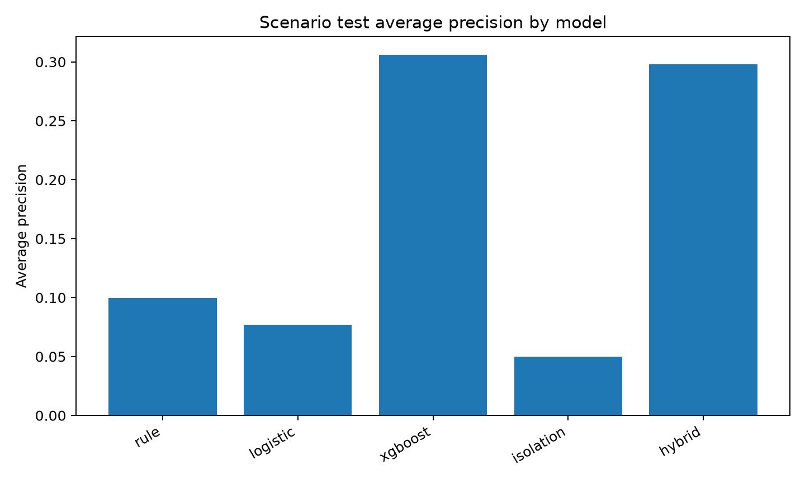
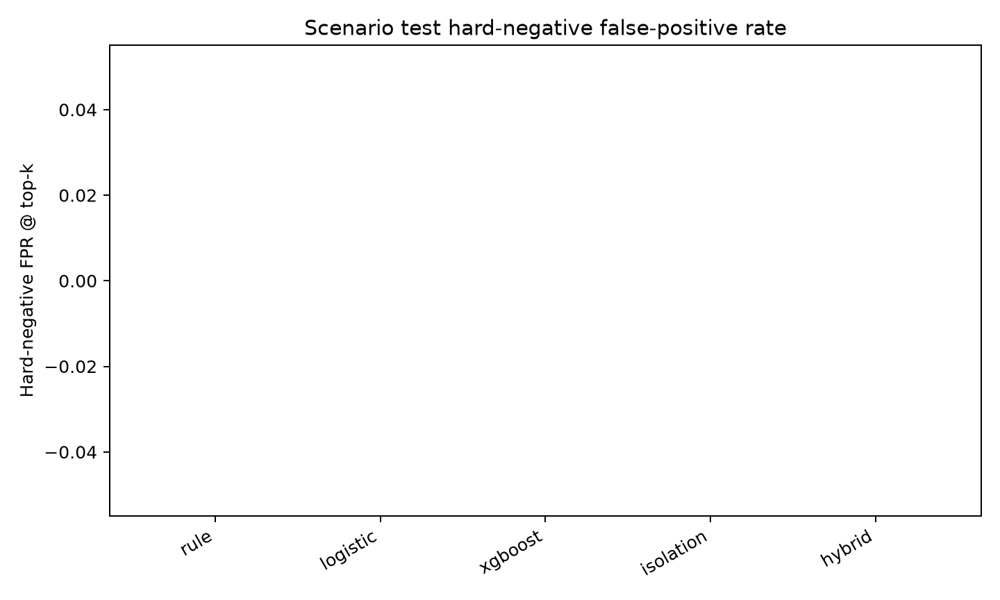
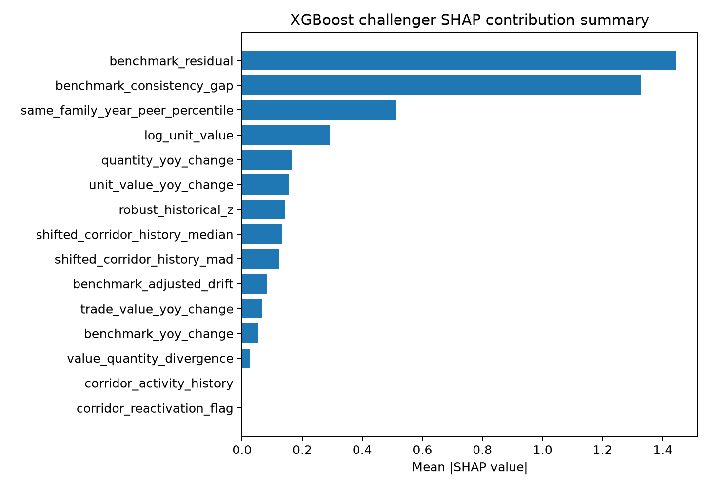

# Evidence-First TBML Corridor Drift Lab - Final analytical report

This output prioritises an unusual corridor-product pattern for human review. It does not establish money laundering, misinvoicing, or criminal intent.

## Executive summary

Purpose: Summarize what the official-data lab built and what it found.

This package implements a simplified official-data analytical lab using a filtered official-derived CEPII BACI HS17 V202601 Parquet extract, the World Bank Commodity Markets annual workbook, time-safe features, scenario-based model evaluation, evidence rows, FATF-Egmont typology cards, and grounded analyst briefs.

The official BACI extract contains **25,844 retained panel rows** after row-quality assignment. The panel covers **2017-2024** and exactly three HS6 families: crude palm oil `151110`, refined copper cathodes `740311`, and non-monetary unwrought gold `710812`.

The retained review-priority scoring approach is `hybrid_score` using challenger `xgboost` with validation-selected challenger weight `0.75`. Scores are ranking signals, not probabilities of crime.

## Source feasibility and verification

Purpose: Show that the project ran on the uploaded official or official-derived files and did not substitute synthetic trade data.

### Source file inventory

| file_name                                                         |   size_bytes | sha256                                                           |
|:------------------------------------------------------------------|-------------:|:-----------------------------------------------------------------|
| baci_hs17_v202601_selected_2017_2024_151110_740311_710812.parquet |       340203 | 0e493e057c8fd57902328551a9c874d22aea0e4c3437432617489c7c3571fe12 |
| data_source_notes.json                                            |         4342 | a8a973d0797cbfcd4064b1dfd071faa441bdc7b766e719af9bbb53014365bfe6 |
| CMO-Historical-Data-Annual.xlsx                                   |      3177955 | 9fbcb348f40ecdb02eb1bcf858a2965383d2aaf3445e8920dd7d60ae7b04af51 |
| Trade-Based-Money-Laundering-Trends-and-Developments_2020.pdf     |      3108080 | 0969e49877a1937a7bc49ac02ab10a444adca2c2ff2c7803ee6a35adea9f6828 |
| Trade-Based-Money-Laundering-Risk-Indicators_2021.pdf             |      2079148 | 670b80270b33354b17263d44393cd65386a96bdb1a171365f217048e7cca6afb |
| country_codes_V202601.csv                                         |         5346 | c6892f28bea23d689b29b074d299cea7f5196c708b03026fbe419fa4ecb4e820 |
| product_codes_HS17_V202601.csv                                    |       598831 | 4abb74d330c3a1969ccfc4652e6ef849963980d55e45ad768eb54a32747efd5e |
| baci-readme.txt                                                   |          571 | 156c8fe9d8582f24fdec5c43d912e3736dc515a6efd5cd04e513095a0db44c66 |

### Verification summary

| item                         | status   | detail                                                                                                                                                                                                                                                                                                 |
|:-----------------------------|:---------|:-------------------------------------------------------------------------------------------------------------------------------------------------------------------------------------------------------------------------------------------------------------------------------------------------------|
| BACI row count               | pass     | 25844                                                                                                                                                                                                                                                                                                  |
| BACI years                   | pass     | {'2017': 2783, '2018': 3094, '2019': 3279, '2020': 3162, '2021': 3358, '2022': 3510, '2023': 3445, '2024': 3213}                                                                                                                                                                                       |
| BACI HS6                     | pass     | {'151110': 6717, '710812': 12205, '740311': 6922}                                                                                                                                                                                                                                                      |
| World Bank annual benchmarks | pass     | {'crude_palm_oil': 'USD per metric ton', 'gold_unwrought': 'USD per troy ounce', 'refined_copper_cathodes': 'USD per metric ton'}                                                                                                                                                                      |
| FATF-Egmont PDFs             | pass     | [{'file_name': 'Trade-Based-Money-Laundering-Trends-and-Developments_2020.pdf', 'pages': 66, 'readable': True, 'sample_text_length_first_pages': 3461}, {'file_name': 'Trade-Based-Money-Laundering-Risk-Indicators_2021.pdf', 'pages': 10, 'readable': True, 'sample_text_length_first_pages': 4408}] |
| Web check                    | pass     | Web search found official FATF pages for the 2020 trends report and 2021 risk indicators; no newer official TBML-specific replacement was identified during this run.                                                                                                                                  |

BACI `v` is interpreted as thousands of current USD and multiplied by 1,000. BACI `q` is interpreted as metric tons. HS6 `k` is treated as a six-character string.

### HS6 family coverage

|    hs6 | family_id               | product_name                |   panel_rows |
|-------:|:------------------------|:----------------------------|-------------:|
| 151110 | crude_palm_oil          | Crude palm oil              |         6717 |
| 710812 | gold_unwrought          | Non-monetary unwrought gold |        12205 |
| 740311 | refined_copper_cathodes | Refined copper cathodes     |         6922 |

### Row quality status

| quality_status                            |   rows |
|:------------------------------------------|-------:|
| fully_usable                              |  11894 |
| usable_with_caveat                        |  11762 |
| excluded_from_modeling_retained_for_audit |   2188 |

## Official-data pipeline architecture

Purpose: Show the actual simplified architecture implemented in this package.

*Official-data pipeline architecture*

*Data flow from source files to final outputs*

## World Bank benchmark handling

Purpose: Explain benchmark extraction and unit normalization.

Palm oil and copper benchmarks are preserved as USD per metric ton. Gold is preserved in its original USD per troy ounce unit and converted to USD per metric ton using `gold_usd_per_metric_ton = gold_usd_per_troy_ounce * (1_000_000 / 31.1034768)`.

| family_id      |    hs6 |   benchmark_year |   benchmark_price_original | benchmark_unit_original   |   benchmark_price_usd_per_metric_ton | benchmark_conversion_method                      |
|:---------------|-------:|-----------------:|---------------------------:|:--------------------------|-------------------------------------:|:-------------------------------------------------|
| crude_palm_oil | 151110 |             2017 |                     750.81 | USD per metric ton        |                        750.81        | identity                                         |
| crude_palm_oil | 151110 |             2018 |                     638.66 | USD per metric ton        |                        638.66        | identity                                         |
| crude_palm_oil | 151110 |             2019 |                     601.37 | USD per metric ton        |                        601.37        | identity                                         |
| crude_palm_oil | 151110 |             2020 |                     751.77 | USD per metric ton        |                        751.77        | identity                                         |
| crude_palm_oil | 151110 |             2021 |                    1130.58 | USD per metric ton        |                       1130.58        | identity                                         |
| crude_palm_oil | 151110 |             2022 |                    1275.99 | USD per metric ton        |                       1275.99        | identity                                         |
| crude_palm_oil | 151110 |             2023 |                     886.45 | USD per metric ton        |                        886.45        | identity                                         |
| crude_palm_oil | 151110 |             2024 |                     963.36 | USD per metric ton        |                        963.36        | identity                                         |
| gold_unwrought | 710812 |             2017 |                    1257.56 | USD per troy ounce        |                          4.04315e+07 | gold_usd_per_troy_ounce * (1000000 / 31.1034768) |
| gold_unwrought | 710812 |             2018 |                    1269.23 | USD per troy ounce        |                          4.08067e+07 | gold_usd_per_troy_ounce * (1000000 / 31.1034768) |
| gold_unwrought | 710812 |             2019 |                    1392.5  | USD per troy ounce        |                          4.47699e+07 | gold_usd_per_troy_ounce * (1000000 / 31.1034768) |
| gold_unwrought | 710812 |             2020 |                    1770.25 | USD per troy ounce        |                          5.69149e+07 | gold_usd_per_troy_ounce * (1000000 / 31.1034768) |

## Time-safe features

Purpose: Build review signals without letting current rows define their own history or using future years.

*Time-safe feature construction flow*

# Time-safe feature explanation table

| feature_name                     | derivation                                                                                     | why_created                                           | significance_for_review                                                       | time_safety_rule                                              | plain_english_interpretation                                               |
|:---------------------------------|:-----------------------------------------------------------------------------------------------|:------------------------------------------------------|:------------------------------------------------------------------------------|:--------------------------------------------------------------|:---------------------------------------------------------------------------|
| log_unit_value                   | log(unit_value_usd_per_metric_ton)                                                             | Stabilizes skewed unit values.                        | Shows unusually high or low implied prices within a product family.           | Uses only the current row's official value and quantity.      | The aggregate implied price on a log scale.                                |
| shifted_corridor_history_median  | Median of prior-year log_unit_value for the same exporter-importer-HS6 corridor.               | Builds the corridor's own baseline.                   | Shows whether the row differs from its own past.                              | Prior years only; current/future years excluded.              | What this route-product normally looked like before this year.             |
| shifted_corridor_history_mad     | Median absolute deviation of prior prior-year log_unit_value.                                  | Gives robust historical spread.                       | Large current deviations matter more when history is stable.                  | Prior years only.                                             | How much this route-product used to vary.                                  |
| robust_historical_z              | (log_unit_value - shifted median) / shifted MAD with a safe denominator.                       | Measures distance from prior corridor behavior.       | Core drift signal.                                                            | Median and MAD are shifted prior-year values.                 | How far this row is from its own historical pattern.                       |
| same_family_year_peer_percentile | Percentile rank of benchmark_residual within the same HS6/family and year.                     | Compares against contemporaneous peers.               | Finds rows unusual relative to other corridors in the same market year.       | Same-year only; no future-year peer distributions.            | Where this row sits among same-product peers that year.                    |
| trade_value_yoy_change           | log(current trade value / previous observed trade value) for same corridor-HS6.                | Captures sudden value movement.                       | Highlights sharp trade value jumps or falls.                                  | Previous observation only.                                    | How much aggregate value changed since the previous active year.           |
| quantity_yoy_change              | log(current quantity / previous observed quantity) for same corridor-HS6.                      | Separates value growth from physical quantity growth. | Shows whether value changes are volume-driven.                                | Previous observation only.                                    | How much physical quantity changed.                                        |
| unit_value_yoy_change            | log(current unit value / previous observed unit value).                                        | Captures implied price movement.                      | Important for valuation-style review.                                         | Previous observation only.                                    | How much the implied price changed.                                        |
| benchmark_residual               | log_unit_value - log(World Bank benchmark USD per metric ton).                                 | Adds macro commodity context.                         | Separates corridor-specific gaps from broad commodity levels.                 | Uses benchmark for the same year only.                        | The gap between observed aggregate unit value and broad market context.    |
| benchmark_adjusted_drift         | benchmark_residual - previous observed benchmark_residual.                                     | Looks at movement after broad benchmark changes.      | Reduces false positives when commodity markets move broadly.                  | Previous residual only.                                       | Whether the gap to benchmark changed compared with this route's prior gap. |
| corridor_activity_history        | Count of prior active years for exporter-importer-HS6.                                         | Captures history depth.                               | Short-history rows need caveats.                                              | Prior years only.                                             | How many earlier years this route-product appeared.                        |
| corridor_novelty_flag            | 1 if no prior active year exists; else 0.                                                      | Flags new corridors.                                  | New corridors can matter when paired with extreme values.                     | Prior activity only.                                          | This route-product is new in the observed panel.                           |
| corridor_reactivation_flag       | 1 if prior activity exists and the previous active year is not the immediately preceding year. | Captures reappearing routes.                          | Reactivation can matter with large valuation changes.                         | Prior activity pattern only.                                  | The route-product disappeared and came back.                               |
| value_quantity_divergence        | trade_value_yoy_change - quantity_yoy_change.                                                  | Identifies value moving faster than quantity.         | Useful for valuation-style review patterns.                                   | Based on previous-observation changes only.                   | Value changed more than physical volume.                                   |
| missingness_flags                | Binary flags for missing quantity, benchmark, history, or country mapping.                     | Makes data limits explicit.                           | Prevents data-quality issues from being mistaken for suspiciousness.          | Missingness reflects available data at the row time.          | What key information is missing.                                           |
| data_quality_flags               | Flags and additive score for quantity, benchmark, history, and provenance completeness.        | Separates confidence from anomaly strength.           | Low quality caveats a case; it should not automatically raise suspiciousness. | Uses source/provenance and prior history only where relevant. | How usable and well-supported the row is.                                  |

## Scenario layer and model comparison

Purpose: Evaluate ranking methods without pretending that public BACI contains confirmed TBML labels.

*Train / validation / test ML workflow*

### Frozen split summary

| split      | years                  |   rows |   synthetic_positive_rows |   hard_negative_rows |
|:-----------|:-----------------------|-------:|--------------------------:|---------------------:|
| train      | 2017, 2018, 2019, 2020 |  12318 |                       108 |                   72 |
| validation | 2021, 2022             |   6868 |                       108 |                   72 |
| test       | 2023, 2024             |   6658 |                       108 |                   72 |

### Model comparison - test split, all families

| model     |   precision_at_k |   recall_at_k |   lift_at_k |   average_precision |   hard_negative_false_positive_rate |   ordinary_false_positive_rate |
|:----------|-----------------:|--------------:|------------:|--------------------:|------------------------------------:|-------------------------------:|
| xgboost   |             0.5  |     0.231481  |    27.9306  |           0.306143  |                                   0 |                     0.00427131 |
| hybrid    |             0.48 |     0.222222  |    26.8133  |           0.297849  |                                   0 |                     0.00444217 |
| rule      |             0.14 |     0.0648148 |     7.82056 |           0.0996167 |                                   0 |                     0.00734666 |
| logistic  |             0.06 |     0.0277778 |     3.35167 |           0.0770069 |                                   0 |                     0.00803007 |
| isolation |             0.06 |     0.0277778 |     3.35167 |           0.0499403 |                                   0 |                     0.00803007 |

*Model comparison figure*

*Hard-negative false-positive comparison*

*SHAP summary - model contribution only*

## Top-ranked official observations

Purpose: Apply the selected scoring approach to real official observations only. Scenario rows are not used in this review queue.

|   rank |   year | exporter_iso3   | importer_iso3   |    hs6 | product_name                |   selected_review_priority_score | quality_status     |   key_evidence_count |
|-------:|-------:|:----------------|:----------------|-------:|:----------------------------|---------------------------------:|:-------------------|---------------------:|
|      1 |   2022 | ESP             | NLD             | 710812 | Non-monetary unwrought gold |                         0.989129 | usable_with_caveat |                    4 |
|      2 |   2022 | KWT             | NPL             | 710812 | Non-monetary unwrought gold |                         0.985756 | usable_with_caveat |                    4 |
|      3 |   2022 | QAT             | NPL             | 710812 | Non-monetary unwrought gold |                         0.98547  | usable_with_caveat |                    4 |
|      4 |   2022 | HKG             | NPL             | 710812 | Non-monetary unwrought gold |                         0.98547  | usable_with_caveat |                    4 |
|      5 |   2022 | SAU             | NPL             | 710812 | Non-monetary unwrought gold |                         0.984675 | usable_with_caveat |                    4 |
|      6 |   2022 | ITA             | MKD             | 151110 | Crude palm oil              |                         0.980196 | usable_with_caveat |                    4 |
|      7 |   2024 | GBR             | ITA             | 740311 | Refined copper cathodes     |                         0.980173 | usable_with_caveat |                    4 |
|      8 |   2022 | CAF             | CHE             | 710812 | Non-monetary unwrought gold |                         0.978825 | fully_usable       |                    4 |
|      9 |   2018 | USA             | IRL             | 740311 | Refined copper cathodes     |                         0.978747 | usable_with_caveat |                    4 |
|     10 |   2020 | ITA             | TUR             | 740311 | Refined copper cathodes     |                         0.975341 | usable_with_caveat |                    4 |
|     11 |   2022 | SGP             | JPN             | 740311 | Refined copper cathodes     |                         0.974686 | usable_with_caveat |                    4 |
|     12 |   2024 | CHN             | GHA             | 740311 | Refined copper cathodes     |                         0.973245 | usable_with_caveat |                    4 |
|     13 |   2019 | IND             | ITA             | 710812 | Non-monetary unwrought gold |                         0.97265  | usable_with_caveat |                    4 |
|     14 |   2020 | BEL             | SVK             | 740311 | Refined copper cathodes     |                         0.972575 | usable_with_caveat |                    4 |
|     15 |   2019 | NGA             | IRL             | 151110 | Crude palm oil              |                         0.971741 | usable_with_caveat |                    4 |
|     16 |   2022 | DEU             | BRA             | 740311 | Refined copper cathodes     |                         0.971565 | usable_with_caveat |                    4 |
|     17 |   2022 | MYS             | NPL             | 710812 | Non-monetary unwrought gold |                         0.971243 | usable_with_caveat |                    4 |
|     18 |   2022 | KOR             | NPL             | 710812 | Non-monetary unwrought gold |                         0.971243 | usable_with_caveat |                    4 |
|     19 |   2022 | JPN             | PHL             | 710812 | Non-monetary unwrought gold |                         0.970299 | usable_with_caveat |                    4 |
|     20 |   2023 | NLD             | SGP             | 740311 | Refined copper cathodes     |                         0.969581 | usable_with_caveat |                    4 |

## Evidence and grounded briefs

Purpose: Convert scores into recomputable facts and bounded analyst-facing narratives.

*Evidence and grounded brief flow*

### Evidence table sample

| evidence_id           | obs_id                   | evidence_type             | metric_name               |   observed_value |   threshold | severity   | plain_english_summary                                                                                                                                          |
|:----------------------|:-------------------------|:--------------------------|:--------------------------|-----------------:|------------:|:-----------|:---------------------------------------------------------------------------------------------------------------------------------------------------------------|
| ev_64fe9330ad36973b98 | obs_c1178b54e91326a9b0f5 | history_deviation         | robust_historical_z       |         18.8267  |         4   | high       | 2022 ESP to NLD 710812 (Non-monetary unwrought gold) differs from its prior corridor history with robust historical z of 18.827. Severity: high.               |
| ev_89c989e7cf036ef947 | obs_c1178b54e91326a9b0f5 | benchmark_adjusted_drift  | benchmark_adjusted_drift  |          1.85827 |         0.7 | high       | 2022 ESP to NLD 710812 (Non-monetary unwrought gold) moved by 1.858 in benchmark-adjusted residual versus the previous observed corridor year. Severity: high. |
| ev_03b1acd36c34032643 | obs_c1178b54e91326a9b0f5 | benchmark_gap             | benchmark_residual        |          1.8505  |         0.7 | high       | 2022 ESP to NLD 710812 (Non-monetary unwrought gold) has a log benchmark residual of 1.850 against the World Bank annual benchmark. Severity: high.            |
| ev_d25e9b9a9f2e0660b3 | obs_c1178b54e91326a9b0f5 | annual_unit_value_change  | unit_value_yoy_change     |          1.8588  |         0.8 | high       | 2022 ESP to NLD 710812 (Non-monetary unwrought gold) has a year-over-year log unit-value change of 1.859. Severity: high.                                      |
| ev_9112748c22f2de5977 | obs_31f1dbac37c15eb7186d | history_deviation         | robust_historical_z       |         12.2572  |         4   | high       | 2022 KWT to NPL 710812 (Non-monetary unwrought gold) differs from its prior corridor history with robust historical z of 12.257. Severity: high.               |
| ev_451e6e42094546bc46 | obs_31f1dbac37c15eb7186d | benchmark_adjusted_drift  | benchmark_adjusted_drift  |          1.99783 |         0.7 | high       | 2022 KWT to NPL 710812 (Non-monetary unwrought gold) moved by 1.998 in benchmark-adjusted residual versus the previous observed corridor year. Severity: high. |
| ev_a07f9ac3f3b75c1484 | obs_31f1dbac37c15eb7186d | annual_unit_value_change  | unit_value_yoy_change     |          1.99837 |         0.8 | high       | 2022 KWT to NPL 710812 (Non-monetary unwrought gold) has a year-over-year log unit-value change of 1.998. Severity: high.                                      |
| ev_cb5cbcfcdc460218ad | obs_31f1dbac37c15eb7186d | value_quantity_divergence | value_quantity_divergence |          1.99837 |         0.8 | high       | 2022 KWT to NPL 710812 (Non-monetary unwrought gold) shows value-quantity divergence of 1.998. Severity: high.                                                 |
| ev_7860c8fa03d5b08d13 | obs_8c4051f3c18beab9e68a | history_deviation         | robust_historical_z       |         19.2111  |         4   | high       | 2022 QAT to NPL 710812 (Non-monetary unwrought gold) differs from its prior corridor history with robust historical z of 19.211. Severity: high.               |
| ev_d6a6bd050796d6d0c2 | obs_8c4051f3c18beab9e68a | benchmark_adjusted_drift  | benchmark_adjusted_drift  |          1.77752 |         0.7 | high       | 2022 QAT to NPL 710812 (Non-monetary unwrought gold) moved by 1.778 in benchmark-adjusted residual versus the previous observed corridor year. Severity: high. |
| ev_80601810fc818cf4e6 | obs_8c4051f3c18beab9e68a | benchmark_gap             | benchmark_residual        |          1.72365 |         0.7 | high       | 2022 QAT to NPL 710812 (Non-monetary unwrought gold) has a log benchmark residual of 1.724 against the World Bank annual benchmark. Severity: high.            |
| ev_a600abc5ed980ad59a | obs_8c4051f3c18beab9e68a | annual_unit_value_change  | unit_value_yoy_change     |          1.77806 |         0.8 | high       | 2022 QAT to NPL 710812 (Non-monetary unwrought gold) has a year-over-year log unit-value change of 1.778. Severity: high.                                      |

### Brief validation summary

| obs_id                   | evidence_id_coverage   |   unsupported_numeric_claim_count |   hallucinated_source_count | missing_caveat_flag   | prohibited_language_flag   | conclusion_boundary_present   | typology_card_ids_present   | status   |
|:-------------------------|:-----------------------|----------------------------------:|----------------------------:|:----------------------|:---------------------------|:------------------------------|:----------------------------|:---------|
| obs_c1178b54e91326a9b0f5 | True                   |                                 0 |                           0 | False                 | False                      | True                          | True                        | pass     |
| obs_31f1dbac37c15eb7186d | True                   |                                 0 |                           0 | False                 | False                      | True                          | True                        | pass     |
| obs_8c4051f3c18beab9e68a | True                   |                                 0 |                           0 | False                 | False                      | True                          | True                        | pass     |
| obs_c4e5ade4d38d2d3dd148 | True                   |                                 0 |                           0 | False                 | False                      | True                          | True                        | pass     |
| obs_f7e56d6a0431cdbb8c32 | True                   |                                 0 |                           0 | False                 | False                      | True                          | True                        | pass     |

The GenAI layer is implemented as a GenAI-ready, evidence-grounded brief design. The verified output uses deterministic offline rendering; no live LLM call was made.

## Key limitations

Purpose: Explain the project without overclaiming.

- The public BACI panel is annual and aggregate. It is not invoice, shipment, customer, payment, vessel, customs-document, or beneficial-ownership data.

- Commodity benchmarks are macro context and not invoice-level fair value.

- Synthetic review-priority scenarios are for ML evaluation only; they are not real TBML labels.

- FATF-Egmont materials are typology and caveat context only. They are not model features, row-level evidence, labels, or proof.

- Model scores are review-priority scores, not calibrated probabilities or legal findings.

## Conclusion

Purpose: State exactly what the package supports.

The lab produces a validated official-data review queue, evidence table, deterministic analyst briefs, and static dashboard concept for human review prioritization. It supports consistent triage and documentation of unusual corridor-product-year patterns. It does not establish money laundering, misinvoicing, or criminal intent.