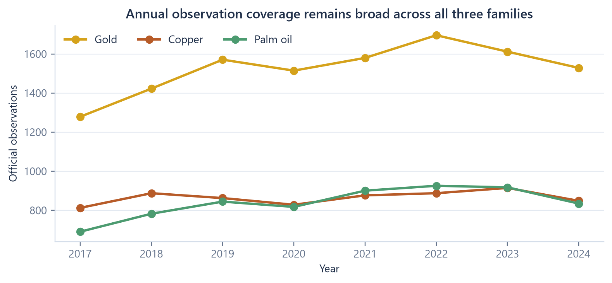
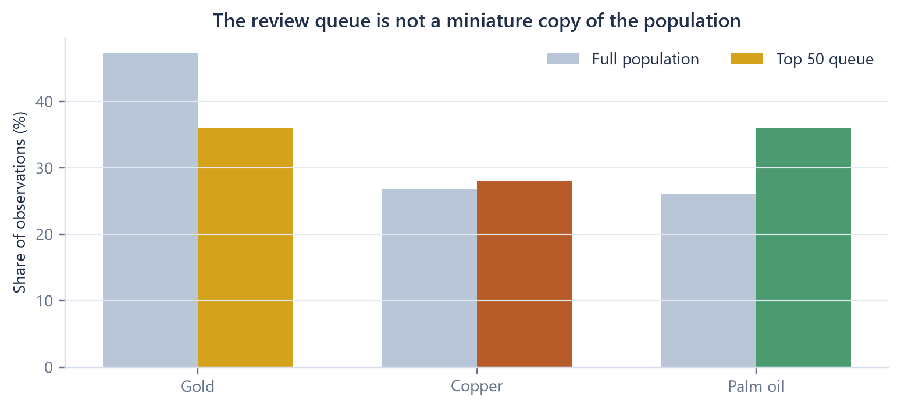
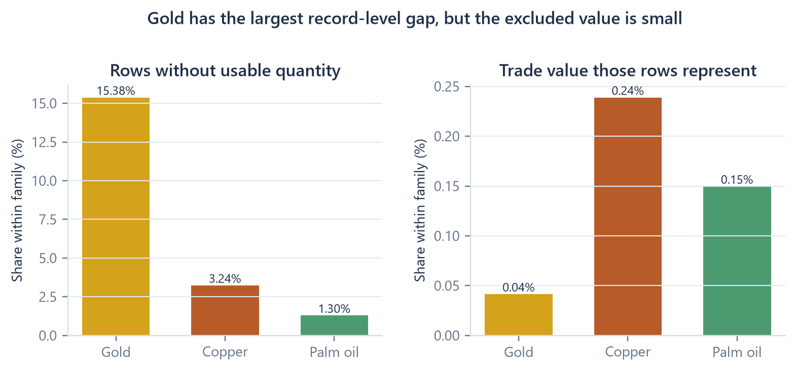
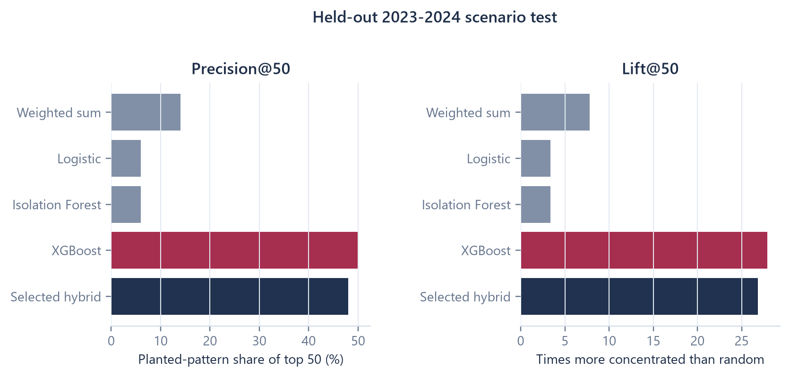
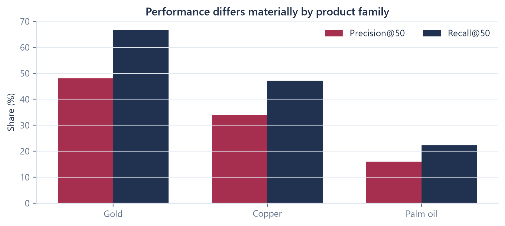
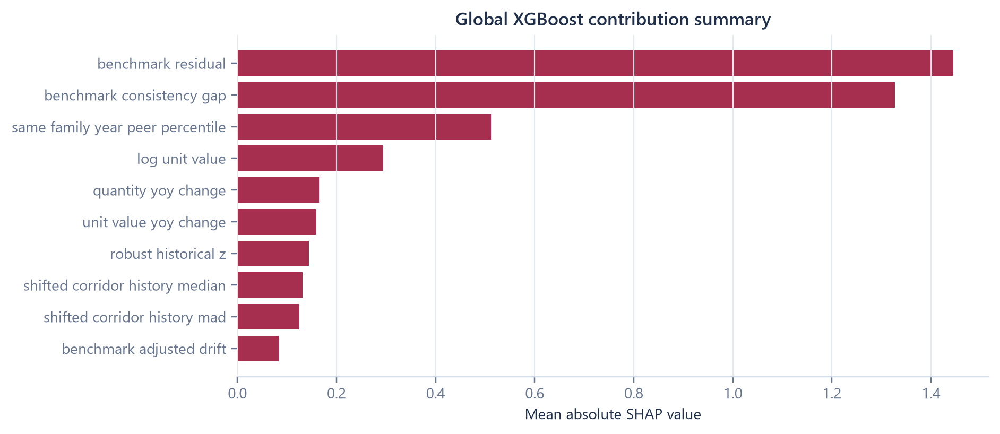
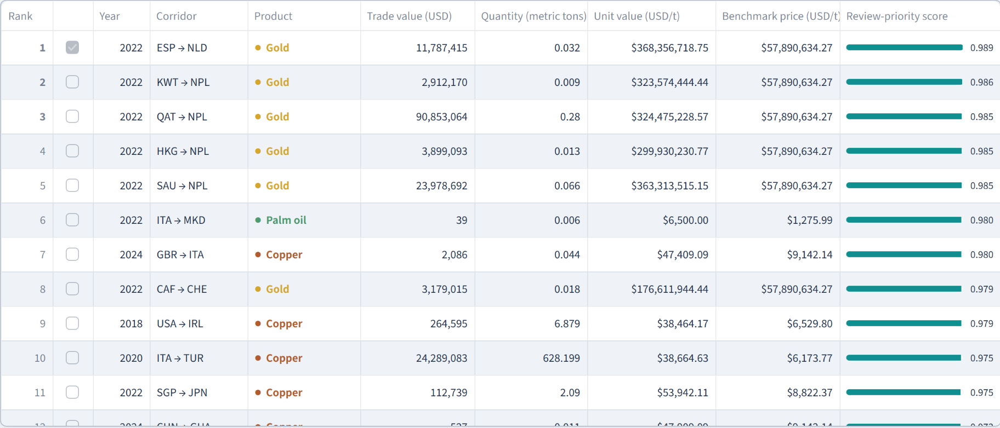
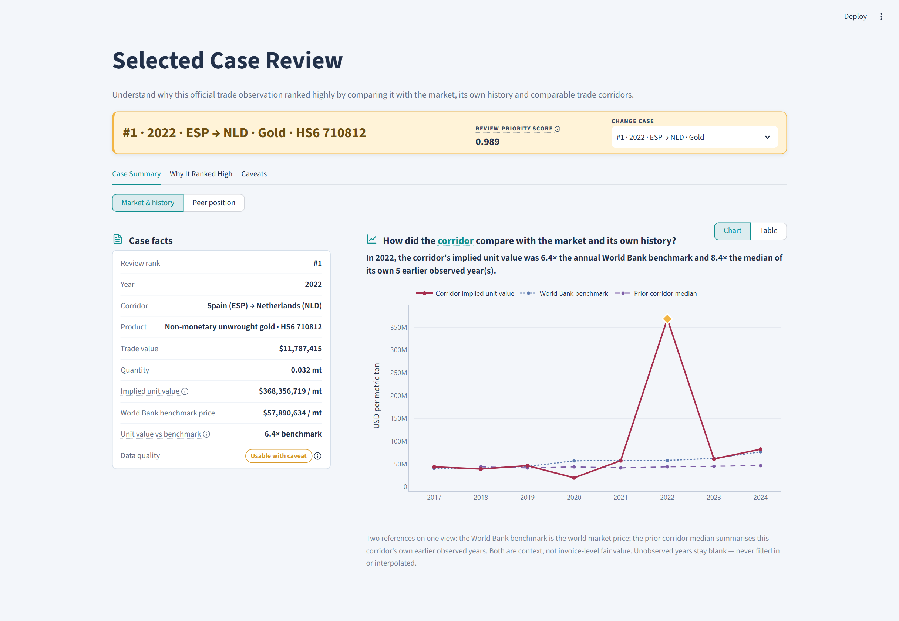

<!-- CLASS: cover -->

<div class="eyebrow">Technical implementation companion</div>

# Evidence-First TBML Triage System

<div class="subtitle">Data engineering, time-safe analytics, controlled model evaluation, evidence construction, and deployment</div>

<p class="summary">A technical account of how official public trade data is transformed into a ranked queue of unusual corridor-product-year patterns for accountable human review.</p>

<div class="cover-identity">
  <div class="cover-id"><strong>25,844</strong><span>official annual observations</span></div>
  <div class="cover-id blue"><strong>2017-2024</strong><span>analytical period</span></div>
  <div class="cover-id amber"><strong>Top 50</strong><span>ranked official queue</span></div>
  <div class="cover-id navy"><strong>27×</strong><span>test lift at 50</span></div>
</div>

<div class="grid-2">
  <div class="card">
    <h3>Document identity</h3>
    <p><strong>Version:</strong> 1.0</p>
    <p><strong>Generated:</strong> 23 July 2026</p>
    <p><strong>Source commit:</strong> <code>{{SOURCE_COMMIT}}</code> on <code>develop</code></p>
    <p><strong>Analytical release:</strong> <code>official-data-simplified-v1</code></p>
  </div>
  <div class="card blue">
    <h3>Implementation status</h3>
    <p><span class="status">Implemented</span> offline analytical pipeline</p>
    <p><span class="status">Deployed</span> read-only Streamlit dashboard</p>
    <p><span class="status future">Future state</span> bank-data integration</p>
  </div>
</div>

<div class="cover-links">
  <strong>Live project:</strong> <a href="https://tbml-review-triage.streamlit.app/">tbml-review-triage.streamlit.app</a><br>
  <strong>Repository:</strong> <a href="https://github.com/jessybaolin/evidence-based-tbml-corridor-drift">github.com/jessybaolin/evidence-based-tbml-corridor-drift</a>
</div>

> **Human-review boundary.** This output prioritises an unusual corridor-product pattern for human review. It does not establish money laundering, misinvoicing, or criminal intent.

<!-- PAGEBREAK -->
<!-- CLASS: control -->

<div class="page-label">Front matter</div>

# Document control {#document-control}

<div class="section-rule"></div>

This companion is the technical layer beneath the stakeholder project brief and live dashboard. It documents the current repository implementation rather than a proposed target architecture.

| Control item | Current record |
|---|---|
| Purpose | Explain the implemented data, analytical, modelling, evidence, dashboard, deployment, and control design |
| Intended audience | Data and analytics practitioners; AFC/AML stakeholders; model-risk reviewers; wholesale-banking technology stakeholders |
| Implementation version | `official-data-simplified-v1` |
| Source commit | `{{SOURCE_COMMIT}}` (`develop`) |
| Analytical period | 2017-2024 |
| Trade dataset | CEPII BACI HS17 release `202601`, filtered to three HS6 products |
| Benchmark dataset | World Bank Commodity Markets annual workbook, 24 family-year rows |
| Deployment status | Public-data, read-only dashboard hosted on Streamlit Community Cloud |
| Owner | Jesslyn Guo Baolin |
| Related document | `stakeholder_project_brief_v2.pdf` |

## How to read implementation status

<div class="grid-4">
  <div class="card"><span class="status">Implemented</span><p>Code or configuration exists in the repository.</p></div>
  <div class="card blue"><span class="status">Generated</span><p>An artefact is produced by a pipeline stage.</p></div>
  <div class="card amber"><span class="status">Validated</span><p>A check or test has executed against the current build.</p></div>
  <div class="card navy"><span class="status future">Future state</span><p>Design intent only; not part of the current application.</p></div>
</div>

## Evidence policy

Every retained metric in this document was checked against current generated outputs or recomputed from current processed data. The working claim-source map is included with the document build at `reports/technical_companion/technical_companion_claim_source_map.csv`.

<div class="decision"><strong>Original preserved.</strong> The seven-page legacy companion remains at <code>docs/afc_aml_technical_companion.pdf</code>. This revision is a separate generated artefact.</div>

<!-- PAGEBREAK -->
<!-- CLASS: toc -->

<div class="page-label">Contents</div>

# Contents: core implementation {#contents-core}

<p class="lede">Select a section to jump to its technical narrative.</p>

<div class="toc-list">
  <a class="toc-item" href="#technical-executive-overview"><span>01</span><div><strong>Technical executive overview</strong><small>Problem, output, components, and implementation status.</small></div><b>5</b></a>
  <a class="toc-item" href="#scope-and-boundaries"><span>02</span><div><strong>Scope, intended use, and boundaries</strong><small>Permitted use and prohibited interpretations.</small></div><b>6</b></a>
  <a class="toc-item" href="#technical-lifecycle"><span>03</span><div><strong>End-to-end technical lifecycle</strong><small>From verified source files to the live dashboard.</small></div><b>7</b></a>
  <a class="toc-item" href="#data-architecture"><span>04</span><div><strong>Data architecture and lineage</strong><small>Tables, grain, keys, transformations, and consumers.</small></div><b>8</b></a>
  <a class="toc-item" href="#sources-and-products"><span>05</span><div><strong>Sources and product-family design</strong><small>Distinct source roles and the three HS6 families.</small></div><b>11</b></a>
  <a class="toc-item" href="#statistical-profile"><span>06</span><div><strong>Statistical profile</strong><small>Coverage, scale, queue composition, and missing quantity.</small></div><b>12</b></a>
  <a class="toc-item" href="#feature-engineering"><span>07</span><div><strong>Time-safe feature engineering</strong><small>Exact formulas, grouping rules, missing handling, and leakage controls.</small></div><b>15</b></a>
  <a class="toc-item" href="#controlled-evaluation"><span>08</span><div><strong>Controlled evaluation scenarios</strong><small>Why scenarios exist and how they remain separate from official cases.</small></div><b>19</b></a>
  <a class="toc-item" href="#scoring-models"><span>09</span><div><strong>Scoring and model implementation</strong><small>Weighted sum, logistic, XGBoost, Isolation Forest, and hybrid.</small></div><b>20</b></a>
</div>

<!-- PAGEBREAK -->
<!-- CLASS: toc -->

<div class="page-label">Contents</div>

# Contents: outputs, controls, and appendices {#contents-outputs}

<div class="toc-list">
  <a class="toc-item" href="#model-evaluation"><span>10</span><div><strong>Model evaluation and selection</strong><small>Metrics, held-out results, family variation, and SHAP boundary.</small></div><b>23</b></a>
  <a class="toc-item" href="#official-queue"><span>11</span><div><strong>Official scoring and review queue</strong><small>Eligibility, ranking, persistence, filters, and export.</small></div><b>25</b></a>
  <a class="toc-item" href="#evidence-construction"><span>12</span><div><strong>Evidence and selected-case analytics</strong><small>Recomputable evidence, case views, and traceability.</small></div><b>26</b></a>
  <a class="toc-item" href="#streamlit-implementation"><span>13</span><div><strong>Streamlit implementation</strong><small>Pages, components, services, contracts, caching, and state.</small></div><b>27</b></a>
  <a class="toc-item" href="#deployment"><span>14</span><div><strong>GitHub and Streamlit deployment</strong><small>Actual hosted path and runtime separation.</small></div><b>28</b></a>
  <a class="toc-item" href="#validation"><span>15</span><div><strong>Validation and reproducibility</strong><small>Controls, tests, current status, and core commands.</small></div><b>29</b></a>
  <a class="toc-item" href="#limitations-future"><span>16</span><div><strong>Limitations and future bank pathway</strong><small>Responsible interpretation and clearly separated future state.</small></div><b>30</b></a>
  <a class="toc-item" href="#appendix-features"><span>A</span><div><strong>Feature reference</strong><small>Complete implemented feature dictionary.</small></div><b>31</b></a>
  <a class="toc-item" href="#appendix-data"><span>B-H</span><div><strong>Technical appendices</strong><small>Data fields, model configuration, scenarios, sources, commands, glossary, and traceability.</small></div><b>33</b></a>
</div>

<div class="banner">
  <div><strong>Traceability principle</strong><br>Dashboard statement → source artefact → transformation → code module → interpretation boundary.</div>
</div>

<!-- PAGEBREAK -->
<!-- CLASS: overview -->

<div class="page-label">1 · System purpose</div>

# Technical executive overview {#technical-executive-overview}

<div class="section-rule"></div>

The project addresses a prioritisation problem. Public trade data contains thousands of annual country-to-country product observations, but no confirmed TBML labels and no customer, invoice, shipment, payment, or ownership records. The implemented system therefore ranks unusual analytical patterns for review; it does not classify financial crime.

<div class="kpi-grid">
  <div class="kpi"><strong>25,844</strong><span>official observations</span></div>
  <div class="kpi blue"><strong>23,656</strong><span>eligible for scoring</span></div>
  <div class="kpi amber"><strong>50</strong><span>ranked review cases</span></div>
  <div class="kpi red"><strong>200</strong><span>evidence rows</span></div>
</div>

## Unit of analysis and output

One row is one exporter-importer-HS6-year aggregate. The selected method scores the 23,656 rows with positive trade value and usable quantity, sorts them deterministically, persists the Top 50, and attaches four evidence checks to each queued observation.

<div class="flow">
  <div class="flow-node"><b>Input</b><strong>Official annual trade</strong><small>Value, quantity, corridor, product, year</small></div>
  <div class="flow-node teal"><b>Analytics</b><strong>Time-safe signals</strong><small>History, peers, benchmark, movement, quality</small></div>
  <div class="flow-node red"><b>Evaluation</b><strong>Controlled scenarios</strong><small>Used to compare methods, never displayed as cases</small></div>
  <div class="flow-node amber"><b>Output</b><strong>Queue plus evidence</strong><small>Read-only stakeholder dashboard</small></div>
</div>

## Offline pipeline, online presentation

The analytical pipeline runs as separate Python stages and writes Parquet, CSV, JSON, joblib, report, and figure artefacts. The Streamlit application loads those generated files, caches them, applies interactive filters, persists the selected case in session state, and renders charts and tables. It does not rebuild the panel, inject scenarios, retrain models, or write data.

<div class="decision"><strong>Design decision: precompute, then present.</strong> This keeps stakeholder interaction fast and makes every displayed number traceable to a versioned artefact. The trade-off is that the dashboard is not a live scoring service.</div>

<!-- PAGEBREAK -->
<!-- CLASS: boundaries -->

<div class="page-label">2 · Intended use</div>

# Scope, intended use, and analytical boundaries {#scope-and-boundaries}

<div class="section-rule"></div>

<div class="matrix">
  <div class="do"><h3>What the system does</h3><ul><li>Ranks unusual annual corridor-product-year patterns.</li><li>Compares a row with its prior history, same-year peers, and a broad commodity benchmark.</li><li>Shows data-quality caveats and recomputable evidence.</li><li>Supports an accountable human decision about what to review next.</li></ul></div>
  <div class="dont"><h3>What it does not do</h3><ul><li>Detect, prove, or label money laundering.</li><li>Estimate a probability of criminal activity.</li><li>Determine invoice-level fair value.</li><li>Assign country, customer, or counterparty risk.</li><li>Replace transaction monitoring or investigation.</li></ul></div>
</div>

## Boundaries carried through the design

| Boundary | Technical consequence |
|---|---|
| Annual public aggregates | A unit value is an implied annual average, not an invoice price |
| World Bank benchmark | Used as market context, not corridor-specific fair value |
| FATF-Egmont publications | Used for typology language and questions, never as features or labels |
| No confirmed cases | Controlled scenarios evaluate ranking behaviour; they are not ground truth |
| Missing quantity | Row cannot form unit value and remains outside model scoring |
| Score semantics | Hybrid score determines ordering only; it is not calibrated |
| Global SHAP only | Explains aggregate XGBoost contribution, not an individual case |

<div class="decision"><strong>Design decision: retain incomplete rows.</strong> Rows that cannot be scored remain in the panel and exclusion audit. Silent deletion would improve headline completeness while hiding a data-quality blind spot.</div>

> This output prioritises an unusual corridor-product pattern for human review. It does not establish money laundering, misinvoicing, or criminal intent.

<!-- PAGEBREAK -->
<!-- CLASS: architecture -->

<div class="page-label">3 · Architecture</div>

# End-to-end technical lifecycle {#technical-lifecycle}

<div class="section-rule"></div>

<div class="flow six">
  <div class="flow-node"><b>01 · Official data</b><strong>BACI, World Bank, reference files</strong><small>Source files are hashed, counted, and schema-checked.</small></div>
  <div class="flow-node"><b>02 · Preparation</b><strong>Clean annual panel</strong><small>Mappings, units, benchmark joins, quality status, canonical IDs.</small></div>
  <div class="flow-node teal"><b>03 · Analytics</b><strong>Time-safe feature table</strong><small>Current row, same-year peers, and prior-only corridor history.</small></div>
  <div class="flow-node red"><b>04 · Evaluation</b><strong>Controlled scenario layer</strong><small>Rules and models compared using separated scenario labels.</small></div>
  <div class="flow-node amber"><b>05 · Official output</b><strong>Top 50 and evidence</strong><small>Selected scorer returns to official observations only.</small></div>
  <div class="flow-node teal"><b>06 · Presentation</b><strong>Streamlit dashboard</strong><small>Cached, read-only access to generated analytical artefacts.</small></div>
</div>

## Implemented lifecycle

<div class="stack">
  <div class="stack-row"><strong>Verify and ingest</strong><span><code>00_check_environment.py</code> → <code>01_verify_sources.py</code> → <code>02_ingest_official_sources.py</code></span></div>
  <div class="stack-row"><strong>Prepare and model</strong><span><code>03_build_panel.py</code> → <code>04_build_features.py</code> → <code>05_build_scenarios.py</code> → <code>06_train_evaluate_models.py</code></span></div>
  <div class="stack-row"><strong>Explain and report</strong><span><code>07_build_evidence.py</code> → <code>08_build_briefs.py</code> → <code>09_generate_reports.py</code></span></div>
  <div class="stack-row"><strong>Present and deploy</strong><span><code>dashboard/streamlit_app.py</code> reads committed outputs; GitHub-connected Streamlit Cloud starts the app.</span></div>
</div>

<div class="banner teal"><div><strong>Lifecycle boundary</strong><br>The controlled scenario branch is used to choose and test a ranking method. The official-data branch produces the cases shown to stakeholders.</div></div>

*Figure 1. Technical lifecycle from verified public sources to a deployed, read-only review dashboard.*

<!-- PAGEBREAK -->
<!-- CLASS: data -->

<div class="page-label">4 · Data architecture</div>

# Data architecture and lineage {#data-architecture}

<div class="section-rule"></div>

<div class="two-track">
  <div class="track">
    <h3>Official-data track</h3>
    <div class="stack">
      <div class="stack-row"><strong>Raw</strong><span>BACI extract; country and HS17 mappings; World Bank workbook</span></div>
      <div class="stack-row"><strong>Interim</strong><span><code>raw_baci_selected.parquet</code>; <code>worldbank_commodity_benchmarks.parquet</code></span></div>
      <div class="stack-row"><strong>Processed</strong><span><code>corridor_product_year_panel.parquet</code>; <code>corridor_features.parquet</code></span></div>
      <div class="stack-row"><strong>Outputs</strong><span><code>top_ranked_corridors.csv</code>; <code>evidence_table.csv</code>; deterministic briefs</span></div>
    </div>
  </div>
  <div class="track-link">↔</div>
  <div class="track future">
    <h3>Evaluation-only track</h3>
    <div class="stack">
      <div class="stack-row"><strong>Test copy</strong><span><code>scenario_panel.parquet</code> preserves the panel schema</span></div>
      <div class="stack-row"><strong>Labels</strong><span><code>scenario_labels.parquet</code> remains physically separate</span></div>
      <div class="stack-row"><strong>Features</strong><span><code>scenario_features.parquet</code> uses the same feature builder</span></div>
      <div class="stack-row"><strong>Evaluation</strong><span>model scores, comparison, selected parameters, hybrid candidates</span></div>
    </div>
  </div>
</div>

## Canonical identity

The canonical analytical key is `year + exporter_iso3 + importer_iso3 + hs6`. `obs_id` is a stable hash-derived observation identifier, while `source_row_id` links the prepared row back to the filtered BACI source. Evidence rows add their own `evidence_id`.

<div class="decision"><strong>Design decision: one feature builder.</strong> Official and scenario panels pass through the same <code>build_features()</code> function. This reduces train-versus-runtime drift; labels are joined only inside model fitting.</div>

*Figure 2. Separate official and evaluation-only data tracks share transformations without sharing scenario labels.*

<!-- PAGEBREAK -->
<!-- CLASS: artifacts -->

<div class="page-label">4 · Data architecture</div>

# Artefact map: grain, ownership, and consumers

<div class="section-rule"></div>

<div class="compact-table" markdown="1">

| Artefact | Grain / rows | Created by | Main consumer | Purpose |
|---|---|---|---|---|
| `raw_baci_selected.parquet` | source row / 25,844 | stage 02 | stage 03 | Normalised raw fields and source IDs |
| `worldbank_commodity_benchmarks.parquet` | family-year / 24 | stage 02 | stage 03 | Annual benchmark context |
| `corridor_product_year_panel.parquet` | corridor-product-year / 25,844 | stage 03 | stages 04-05; dashboard | Canonical prepared panel |
| `exclusion_audit.csv` | caveated or excluded row / 13,950 | stage 03 | controls; dashboard | Explicit quality and exclusion record |
| `corridor_features.parquet` | official observation / 25,844 | stage 04 | stages 06-07; dashboard | Time-safe analytical signals |
| `scenario_panel.parquet` | copied panel / 25,844 | stage 05 | stage 06 | Controlled transformations only |
| `scenario_labels.parquet` | observation / 25,844 | stage 05 | stage 06 | Split, scenario ID, positive and hard-negative labels |
| `model_scores.csv` | eligible scenario row / 23,656 | stage 06 | evaluation page | Candidate and hybrid scores |
| `model_comparison.csv` | split-family-model / 40 | stage 06 | model review; dashboard | Ranking metrics |
| `top_ranked_corridors.csv` | official queue / 50 | stage 06-07 | dashboard | Persisted review order |
| `evidence_table.csv` | evidence check / 200 | stage 07 | case page; briefs | Recomputable case facts |
| `analyst_briefs.json` | brief / 5 | stage 08 | reporting reference | Deterministic, caveated top-case briefs |

</div>

Required dashboard files fail visibly if absent. Optional files return a labelled empty state; the application never substitutes demo data.

## Unit and key controls

- HS6 remains a six-character string.
- BACI `v` is multiplied by 1,000 to obtain current USD.
- BACI `q` is retained in metric tons.
- Gold benchmark USD/troy ounce is converted to USD/metric ton.
- Canonical keys are checked for duplicates.
- Every panel row is retained unless explicitly classified; exclusions remain auditable.

<!-- PAGEBREAK -->
<!-- CLASS: transformations -->

<div class="page-label">4 · Data architecture</div>

# Preparation rules and quality classification

<div class="section-rule"></div>

## Core transformations

<div class="grid-2">
  <div class="card blue"><h3>Trade value</h3><div class="equation-box">$$V_{\mathrm{USD}} = 1000 \times v_{\mathrm{BACI}}$$</div><p>BACI reports value in thousands of current USD.</p></div>
  <div class="card"><h3>Quantity</h3><div class="equation-box">$$Q_{\mathrm{mt}} = q_{\mathrm{BACI}}$$</div><p>The selected BACI quantity is already reported in metric tons.</p></div>
  <div class="card amber"><h3>Implied unit value</h3><div class="equation-box">$$UV_{c,p,t} = \frac{V_{c,p,t}}{Q_{c,p,t}}$$</div><p>Calculated only when value and quantity are positive.</p></div>
  <div class="card red"><h3>Gold benchmark</h3><div class="equation-box">$$B_{\mathrm{mt}} = B_{\mathrm{oz}} \times \frac{1{,}000{,}000}{31.1034768}$$</div><p>Converts USD/troy ounce to USD/metric ton.</p></div>
</div>

## Quality status

`data_quality_score` ranges from 0 to 6: one point for valid quantity, two for a matched benchmark, up to two for history depth, and one for core-field completeness. The status is assigned separately:

- **Fully usable:** valid value and quantity, matched benchmark, enough history, no retained extreme caveat.
- **Usable with caveat:** eligible for modelling but history is short or the row is a valid extreme.
- **Excluded from modelling, retained for audit:** unit value cannot be computed, mainly because quantity is unavailable.

<div class="decision"><strong>Important distinction.</strong> Missing quantity excludes the row. For otherwise eligible rows, lower data quality can reduce the transparent weighted sum by at most 0.08. Data weakness does not increase unusualness.</div>

<!-- PAGEBREAK -->
<!-- CLASS: sources -->

<div class="page-label">5 · Sources and scope</div>

# Official data sources and product-family design {#sources-and-products}

<div class="section-rule"></div>

<div class="grid-3">
  <div class="card blue"><h3>CEPII BACI</h3><p><strong>Role:</strong> annual bilateral trade facts.</p><p>Value and quantity by exporter, importer, year, and HS6 product.</p><p class="note">Official-derived filtered extract; annual aggregates, not transactions.</p></div>
  <div class="card"><h3>World Bank</h3><p><strong>Role:</strong> broad market-price context.</p><p>Annual palm-oil, copper, and gold benchmark series.</p><p class="note">Not corridor-specific landed price or invoice fair value.</p></div>
  <div class="card amber"><h3>FATF-Egmont</h3><p><strong>Role:</strong> typology language, caveats, and review questions.</p><p>Published 2020 trends and 2021 risk-indicator references.</p><p class="note">Never a feature, label, or row-level fact.</p></div>
</div>

## Why these three HS6 products

<div class="grid-3">
  <div class="card palm"><h3>Crude palm oil · 151110</h3><p>High-volume bulk commodity with a usable annual benchmark. It tests behaviour around established physical flows.</p></div>
  <div class="card copper"><h3>Refined copper cathodes · 740311</h3><p>Industrial metal with a widely followed market reference. It tests benchmark-relative movement.</p></div>
  <div class="card gold"><h3>Non-monetary unwrought gold · 710812</h3><p>Compact, high-value product relevant to TBML typologies. The code excludes powder and does not reveal purity, form, or contract terms.</p></div>
</div>

The families deliberately vary in volume, value concentration, market structure, and benchmark scale. That variation makes family-level evaluation necessary: a method that works well for gold may not behave the same way for palm oil.

<div class="decision"><strong>Design decision: one exact HS6 code per family.</strong> This sacrifices wider commodity coverage in return for clearer comparisons, stable benchmark mapping, and easier interpretation.</div>

<!-- PAGEBREAK -->
<!-- CLASS: profile -->

<div class="page-label">6 · Statistical profile</div>

# Coverage and economic scale {#statistical-profile}

<div class="section-rule"></div>

<div class="figure compact">
  
  <p class="caption"><strong>Figure 3.</strong> Official row coverage by year and family. Source: current corridor-product-year panel.</p>
</div>

The panel contains 25,844 annual observations: 12,205 gold, 6,922 copper, and 6,717 palm-oil rows. Annual coverage ranges from 2,783 rows in 2017 to 3,510 in 2022. The chart describes record availability, not suspiciousness.

## Value and quantity tell different stories

| Family | Official rows | Trade value | Share of scoped value | Main interpretation |
|---|---:|---:|---:|---|
| Gold | 12,205 | USD 2.851tn | 81.01% | Value-weighted totals are dominated by gold |
| Copper | 6,922 | USD 573.3bn | 16.29% | Industrial benchmark context is material |
| Palm oil | 6,717 | USD 95.1bn | 2.70% | High physical quantity, lower value share |

<div class="decision"><strong>Statistical consequence.</strong> A portfolio-level value-weighted statistic is mostly a statement about gold. The dashboard therefore shows each product family separately where scales differ materially.</div>

The profiling notebook also showed large within-family dispersion in implied unit value. That observation motivates log transformations, robust prior-history comparisons, same-year peer positioning, and explicit caveats for small quantities.

<!-- PAGEBREAK -->
<!-- CLASS: profile -->

<div class="page-label">6 · Statistical profile</div>

# From the population to the Top 50

<div class="section-rule"></div>

<div class="figure compact">
  
  <p class="caption"><strong>Figure 4.</strong> Product-family composition in the full panel and the selected official queue.</p>
</div>

The Top 50 contains 18 gold, 18 palm-oil, and 14 copper observations. Palm oil is therefore more prominent in the queue than in the full row population, while gold is less dominant by count than it is by value.

## What the queue profile means

- Sixteen of the 50 rows are from 2022, making it the largest queue year.
- Forty-five rows are `usable_with_caveat`; the common reason is a retained valid extreme or limited history, not missing quantity.
- The queued rows together represent only 0.0061% of total scoped trade value. Rank is driven by unusual-pattern signals, not economic size.
- Every queued row has usable value and quantity. Missing quantity cannot create a high unit-value score.

<div class="decision"><strong>Design decision: separate unusualness from materiality.</strong> The current ranker answers “which patterns are analytically unusual?” It does not impose a minimum transaction value. A bank implementation would add customer, transaction, and materiality context before deciding review priority.</div>

The queue is a triage surface, not a prevalence estimate. Its composition must not be interpreted as a claim that one product, year, or country is riskier.

<!-- PAGEBREAK -->
<!-- CLASS: gold-gap -->

<div class="page-label">6 · Statistical profile</div>

# Gold rows without usable quantity

<div class="section-rule"></div>

<div class="figure compact">
  
  <p class="caption"><strong>Figure 5.</strong> Missing quantity is large by record count in gold but small by reported trade value.</p>
</div>

Gold has 1,877 rows without usable quantity, 15.38% of gold records. Those rows represent USD 1.183bn, only 0.04149% of gold value. This is why the analysis is a coverage control rather than an anomaly story: a meaningful share of records cannot be assessed, but almost all reported value remains covered.

## What the deeper audit found

One 2024 United Arab Emirates-to-Thailand row accounts for 70.9% of excluded gold value, but quantity is usable in the other seven years of that route. Separately, 14 routes are present in every year from 2017 to 2024 and lack usable quantity in every year. Twelve touch the Netherlands, yet all 14 together carry only USD 1.0m, or 0.08455% of excluded gold value.

<div class="grid-2">
  <div class="card amber"><h3>Large one-year gap</h3><p>Financially prominent within the excluded subset; best treated as a source-record check, not a route-wide conclusion.</p></div>
  <div class="card"><h3>Small recurring gaps</h3><p>Operationally traceable because the same routes repeat; not financially material and not a country-risk signal.</p></div>
</div>

Missing quantity is retained for audit, monitored separately, and never converted into review priority.

<!-- PAGEBREAK -->
<!-- CLASS: features -->

<div class="page-label">7 · Feature engineering</div>

# Feature foundations {#feature-engineering}

<div class="section-rule"></div>

The current model input list contains 22 fields. Some are direct or transformed values; others encode history, peers, benchmark movement, corridor status, missingness, and data quality. All are calculated at the corridor-product-year grain.

## Level and benchmark features

<div class="grid-2">
  <div class="card">
    <h3>Log unit value</h3>
    <div class="equation-box">$$L_{c,p,t} = \log(UV_{c,p,t})$$</div>
    <p>Compresses the highly skewed unit-value scale. Undefined when value or quantity is non-positive.</p>
  </div>
  <div class="card blue">
    <h3>Benchmark residual</h3>
    <div class="equation-box">$$r_{c,p,t} = \log(UV_{c,p,t}) - \log(B_{p,t})$$</div>
    <p>Positive values sit above the annual family benchmark; negative values sit below it.</p>
  </div>
</div>

The residual is a log ratio. A residual of zero means parity with the benchmark; it does not mean “no risk”. The benchmark is a broad market reference and does not observe freight, purity, grade, contract terms, timing, or re-export effects.

## Explicit missingness fields

`missing_quantity_flag`, `missing_benchmark_flag`, `missing_history_flag`, and `missing_country_mapping_flag` preserve data limitations for modelling and audit. Model eligibility still requires a valid unit value, so missing quantity rows do not enter fitted or official scores.

<div class="decision"><strong>Design decision: logs before differences.</strong> Log ratios turn multiplicative changes into additive differences and make a doubling comparable in magnitude to a halving. Zero and missing denominators remain excluded rather than silently replaced.</div>

<!-- PAGEBREAK -->
<!-- CLASS: features -->

<div class="page-label">7 · Feature engineering</div>

# Prior history and same-year peers

<div class="section-rule"></div>

## Shifted corridor history

For each `corridor_id + hs6`, prior log unit values are accumulated in year order. The current row is excluded before the median and median absolute deviation (MAD) are calculated.

<div class="equation-box">
$$m_{c,p,t} = \mathrm{median}\{L_{c,p,s}: s<t\}$$
$$MAD_{c,p,t} = \mathrm{median}\{|L_{c,p,s}-m_{c,p,t}|: s<t\}$$
$$z^{robust}_{c,p,t} = \frac{L_{c,p,t}-m_{c,p,t}}{\max(MAD_{c,p,t},0.05)}$$
</div>

The implementation uses the unscaled MAD, not the normal-consistency factor `1.4826`. If prior MAD is zero or smaller than `1e-9`, the denominator becomes `0.05`. If no prior median exists, the robust z-score remains missing. This can produce large values for short, low-dispersion histories, so history depth is always shown as a caveat.

## Same-family, same-year peer percentile

<div class="equation-box">$$P_{p,t}(r_{c,p,t}) = \mathrm{rank}_{pct}\{r_{\cdot,p,t}\}$$</div>

The percentile ranks the row's benchmark residual among all corridors in the same family and year. Same-year peers are available at assessment time, so this comparison is time-safe even though it is not prior-only.

<div class="decision"><strong>Trade-off: contemporaneous context.</strong> Peer position removes a market-year scale effect, but the peer group can still mix legitimate differences in grade, trade terms, and route structure.</div>

<!-- PAGEBREAK -->
<!-- CLASS: features -->

<div class="page-label">7 · Feature engineering</div>

# Movement, benchmark drift, and corridor status

<div class="section-rule"></div>

For the previous observed row in the same corridor and HS6 group:

<div class="equation-box">
$$\Delta \log X_{c,p,t} = \log\left(\frac{X_{c,p,t}}{X_{c,p,t^-}}\right)$$
</div>

This convention produces `trade_value_yoy_change`, `quantity_yoy_change`, and `unit_value_yoy_change`. The “previous” observation is the prior available row, not necessarily the immediately preceding calendar year.

<div class="grid-2">
  <div class="card blue"><h3>Value-quantity divergence</h3><div class="equation-box">$$D_{c,p,t} = \Delta\log V_{c,p,t} - \Delta\log Q_{c,p,t}$$</div><p>Shows whether value changed faster than reported physical quantity.</p></div>
  <div class="card"><h3>Benchmark-adjusted drift</h3><div class="equation-box">$$\Delta r_{c,p,t} = r_{c,p,t} - r_{c,p,t^-}$$</div><p>Shows whether the corridor's gap to the market benchmark changed.</p></div>
  <div class="card amber"><h3>Benchmark-consistency gap</h3><div class="equation-box">$$C_{c,p,t}=|\Delta\log UV_{c,p,t}-\Delta\log B_{p,t}|$$</div><p>Near zero means corridor unit value moved similarly to the market.</p></div>
  <div class="card red"><h3>Corridor status</h3><p>`corridor_activity_history` counts earlier appearances. `novelty` marks the first. `reactivation` marks a return after a gap of more than one year.</p></div>
</div>

`valid_extreme_flag` records unit value above five times or below 0.2 times the benchmark after basic validity checks. It is a caveat-bearing analytical flag, not proof of mispricing.

<!-- PAGEBREAK -->
<!-- CLASS: timeline -->

<div class="page-label">7 · Feature engineering</div>

# Time-safety and feature use

<div class="section-rule"></div>

<div class="banner teal"><div><strong>Time-safe means no future information.</strong><br>When a 2022 row is assessed, its history features may use 2017-2021. Same-year 2022 peers and the 2022 benchmark are allowed. Data from 2023-2024 is unavailable to that row.</div></div>

<div class="flow">
  <div class="flow-node"><b>2017-2020</b><strong>Prior observations</strong><small>May contribute to shifted history for a later row.</small></div>
  <div class="flow-node"><b>2021</b><strong>Most recent prior row</strong><small>Used for lagged changes when available.</small></div>
  <div class="flow-node teal"><b>2022</b><strong>Row being assessed</strong><small>Current facts, 2022 benchmark, and 2022 peers are available.</small></div>
  <div class="flow-node red"><b>2023-2024</b><strong>Hidden future</strong><small>Never enters the 2022 feature vector.</small></div>
</div>

## Feature roles

| Feature family | Time-safe reference | Weighted sum | ML | Evidence/dashboard |
|---|---|:---:|:---:|:---:|
| Unit value and logs | current row | indirect | yes | yes |
| Prior median, MAD, robust z | prior observations only | yes | yes | yes |
| Same-year peer percentile | same family and year | yes | yes | yes |
| YoY log changes and divergence | previous observed row | yes | yes | yes |
| Benchmark residual and drift | current benchmark; prior residual | yes | yes | yes |
| Novelty and reactivation | prior activity count/year | yes | yes | yes |
| Missingness and quality | current data state | reduction / eligibility | yes | yes |

*Figure 6. Feature construction timeline. The current row can use prior history and contemporaneous market context, never future years.*

<!-- PAGEBREAK -->
<!-- CLASS: scenarios -->

<div class="page-label">8 · Evaluation design</div>

# Controlled evaluation scenarios {#controlled-evaluation}

<div class="section-rule"></div>

Public BACI rows have no confirmed TBML outcome. The project therefore evaluates ranking behaviour on a frozen copy of the clean panel with controlled transformations.

<div class="two-track">
  <div class="track">
    <h3>Official observations</h3>
    <p>Unchanged public rows are feature-engineered and scored after model selection.</p>
    <div class="banner teal"><strong>Output: official Top 50 and evidence</strong></div>
  </div>
  <div class="track-link">≠</div>
  <div class="track future">
    <h3>Controlled scenarios</h3>
    <p>540 selected rows are modified on a test copy: 108 positives and 72 hard negatives in each split.</p>
    <div class="banner red"><strong>Output: model-comparison metrics only</strong></div>
  </div>
</div>

## Scenario catalogue

| Evaluation role | Scenario | Controlled change |
|---|---|---|
| Positive | Over-valuation | Value multiplied 2.2-3.5×; quantity held |
| Positive | Under-valuation | Value multiplied 0.25-0.45×; quantity held |
| Positive | Low volume, high value | Value rises 1.8-2.8×; quantity falls to 0.35-0.65× |
| Hard negative | Benchmark-consistent movement | Unit value aligned with the family-year median benchmark residual |
| Hard negative | Proportional growth | Value and quantity multiplied by the same factor |

Scenario IDs and labels live in `scenario_labels.parquet`, not in the scenario panel or feature table. Forbidden label-like fields are explicitly rejected by `build_features()`.

<div class="decision"><strong>Limitation.</strong> Success on planted patterns shows whether the method recovers the behaviours it was designed to recognise. It is not a real-world crime-detection rate.</div>

<!-- PAGEBREAK -->
<!-- CLASS: rules -->

<div class="page-label">9 · Scoring implementation</div>

# Transparent weighted-sum score {#scoring-models}

<div class="section-rule"></div>

Nine signals are first normalised to the range 0-1 using fixed reference values. Their documented points are added, then two reductions are subtracted.

<div class="equation-box">
$$S_{rule}=\mathrm{clip}_{[0,1]}\left(\sum_j w_j c_j - R_{market} - R_{quality}\right)$$
</div>

<div class="compact-table" markdown="1">

| Positive component | Weight | Reference / construction |
|---|---:|---|
| Prior-history deviation | 0.20 | `abs(robust_z) / 4`, clipped |
| Benchmark residual | 0.18 | `abs(residual) / 1`, clipped |
| Benchmark-adjusted drift | 0.18 | `abs(drift) / 0.70`, clipped |
| Unit-value movement | 0.12 | `abs(unit-value change) / 0.80`, clipped |
| Value-quantity divergence | 0.12 | `abs(divergence) / 0.80`, clipped |
| Peer-tail position | 0.10 | distance from percentile 0.5, doubled |
| New corridor | 0.06 | binary |
| Reactivated corridor | 0.08 | binary |
| Valid extreme | 0.14 | binary |

</div>

## What lowers the score

<div class="grid-2">
  <div class="card blue"><h3>Market-consistency reduction · up to 0.15</h3><p><code>0.15 × (1 - clip(gap / 0.35))</code>. A small gap means unit value moved similarly to the market, so more is subtracted. Once the gap reaches 0.35, the reduction falls to zero.</p></div>
  <div class="card amber"><h3>Data-reliability reduction · up to 0.08</h3><p><code>0.08 × (6 - quality score) / 6</code>. A quality score of 6 subtracts zero. Lower usable scores subtract progressively more. Ineligible rows are never scored.</p></div>
</div>

The weighted sum is auditable but not statistically fitted. Its weights express documented review priorities; they do not estimate causal importance or probability.

<!-- PAGEBREAK -->
<!-- CLASS: models -->

<div class="page-label">9 · Scoring implementation</div>

# Candidate model implementations

<div class="section-rule"></div>

<div class="grid-2">
  <div class="card blue"><h3>Logistic regression baseline</h3><ul><li>Median imputation with missing indicators.</li><li>Standard scaling.</li><li>Balanced class weights.</li><li>Liblinear solver; maximum 2,000 iterations.</li></ul><p class="note">A linear benchmark for whether a simple learned combination is sufficient.</p></div>
  <div class="card red"><h3>XGBoost supervised challenger</h3><ul><li>160 trees; histogram tree method.</li><li>Depth, learning rate, child weight, and L2 penalty compared on validation AP.</li><li>Subsample and column sample 0.9; L1 penalty 0.15.</li><li>Class imbalance handled with `scale_pos_weight`.</li></ul><p class="note">Captures nonlinear interactions between the 22 input fields.</p></div>
  <div class="card"><h3>Isolation Forest side signal</h3><ul><li>Median imputation.</li><li>160 trees; fixed seed.</li><li>Negative decision function min-max scaled to 0-1.</li></ul><p class="note">Unsupervised outlier reference, not selected for the official queue.</p></div>
  <div class="card amber"><h3>Weighted-sum baseline</h3><ul><li>No fitting.</li><li>Fixed weights and references in YAML.</li><li>Component-level decomposition.</li><li>Market and quality reductions.</li></ul><p class="note">Provides an inspectable review logic and the transparent component of the hybrid.</p></div>
</div>

## Selected XGBoost configuration

`max_depth=2`, `learning_rate=0.06`, `min_child_weight=2`, and `reg_lambda=4` produced validation average precision `0.3860`, the best of three deliberately bounded configurations. The seed is `20260117`; training uses 2017-2020 only.

<div class="decision"><strong>Design trade-off.</strong> The search is intentionally narrow. It reduces tuning flexibility and overfitting opportunities, but it does not prove the chosen hyperparameters are globally optimal.</div>

<!-- PAGEBREAK -->
<!-- CLASS: hybrid -->

<div class="page-label">9 · Scoring implementation</div>

# Hybrid selection and test discipline

<div class="section-rule"></div>

The supervised challenger is chosen on 2021-2022 validation average precision. XGBoost wins. Three predefined blends then compete on validation precision@50.

<div class="equation-box">
$$S_{hybrid}=(1-\alpha)S_{rule}+\alpha S_{xgb}$$
$$\alpha \in \{0.25,0.50,0.75\}$$
</div>

| XGBoost weight $\alpha$ | Weighted-sum weight | Validation precision@50 | Recall@50 | AP | Hard-negative FPR |
|---:|---:|---:|---:|---:|---:|
| **0.75** | **0.25** | **0.46** | **0.213** | **0.309** | 0.0139 |
| 0.50 | 0.50 | 0.32 | 0.148 | 0.264 | 0.0139 |
| 0.25 | 0.75 | 0.26 | 0.120 | 0.199 | 0.0139 |

<div class="flow">
  <div class="flow-node"><b>Fit</b><strong>2017-2020</strong><small>Logistic, XGBoost, and Isolation Forest learn from the scenario test copy.</small></div>
  <div class="flow-node teal"><b>Select</b><strong>2021-2022</strong><small>Choose challenger, then predefined blend weight.</small></div>
  <div class="flow-node red"><b>Test once</b><strong>2023-2024</strong><small>Measure the frozen design on unseen years.</small></div>
  <div class="flow-node amber"><b>Apply</b><strong>Official rows</strong><small>Selected method scores real eligible observations only.</small></div>
</div>

Standalone XGBoost later scores slightly higher than the hybrid on held-out test precision@50, `0.50` versus `0.48`. The hybrid remains selected because changing the method after seeing test results would turn the test into another selection set.

<!-- PAGEBREAK -->
<!-- CLASS: evaluation -->

<div class="page-label">10 · Model evaluation</div>

# Metrics and held-out results {#model-evaluation}

<div class="section-rule"></div>

<div class="grid-3">
  <div class="card"><h3>Precision@k</h3><div class="equation-box">$$P@k=\frac{TP_k}{k}$$</div><p>Share of the top queue that contains planted positive patterns.</p></div>
  <div class="card blue"><h3>Recall@k</h3><div class="equation-box">$$R@k=\frac{TP_k}{N_+}$$</div><p>Share of all planted positives recovered in the top queue.</p></div>
  <div class="card amber"><h3>Lift@k</h3><div class="equation-box">$$L@k=\frac{P@k}{N_+/N}$$</div><p>Concentration relative to random selection from the evaluated split.</p></div>
</div>

Average precision summarises ranking quality across thresholds. Hard-negative false-positive rate is the share of planted benign look-alikes that enter the Top 50. Ordinary false-positive rate uses all remaining negative rows and is reported as a diagnostic, not as a real-world false-alert rate.

<div class="figure compact">
  
  <p class="caption"><strong>Figure 7.</strong> Held-out 2023-2024 controlled-scenario results. These are scenario-test metrics, not crime-detection rates.</p>
</div>

The selected hybrid places 24 planted positives in its Top 50: precision `0.48`, recall `0.2222`, lift `26.81`, average precision `0.29785`, and hard-negative false-positive rate `0.0`.

<!-- PAGEBREAK -->
<!-- CLASS: evaluation -->

<div class="page-label">10 · Model evaluation</div>

# Family variation and model interpretation

<div class="section-rule"></div>

<div class="figure compact">
  
  <p class="caption"><strong>Figure 8.</strong> Family-level Top-50 metrics use a separate Top 50 within each product family; they are diagnostic and do not describe the mixed official queue.</p>
</div>

The hybrid's held-out family results differ: gold precision@50 is `0.48` with recall `0.667`; copper is `0.34` / `0.472`; palm oil is `0.16` / `0.222`. The comparison shows heterogeneity, but each family has only 36 planted positives per split. It is evidence for monitoring family behaviour, not for declaring one commodity intrinsically easier or riskier.

<div class="figure compact">
  
  <p class="caption"><strong>Figure 9.</strong> Mean absolute SHAP values for the XGBoost challenger. Magnitude shows average model contribution, not direction, causality, or case evidence.</p>
</div>

Benchmark residual and benchmark-consistency gap dominate the global XGBoost summary, followed by same-family-year peer percentile and log unit value. This explains what the learned challenger uses most across scenario rows.

<div class="decision"><strong>SHAP boundary.</strong> The project produces global SHAP only. Selected-case evidence comes from deterministic feature calculations and thresholds, not row-level SHAP.</div>

<!-- PAGEBREAK -->
<!-- CLASS: queue -->

<div class="page-label">11 · Official output</div>

# Scoring official observations and constructing the queue {#official-queue}

<div class="section-rule"></div>

After selection, the fitted models and fixed weighted sum return to `corridor_features.parquet`. Only rows with valid unit value and an eligible quality status are scored.

<div class="flow">
  <div class="flow-node"><b>Eligibility</b><strong>23,656 official rows</strong><small>Positive value and quantity; usable status.</small></div>
  <div class="flow-node red"><b>Scoring</b><strong>Frozen 75/25 hybrid</strong><small>No scenario IDs or labels are present.</small></div>
  <div class="flow-node teal"><b>Ordering</b><strong>Score descending</strong><small><code>obs_id</code> is a deterministic tie-breaker.</small></div>
  <div class="flow-node amber"><b>Persistence</b><strong>Top 50 CSV</strong><small>Stage 07 adds evidence counts.</small></div>
</div>

<div class="figure queue">
  
  <p class="caption"><strong>Figure 10.</strong> Current live queue capture. Filters re-slice loaded rows; the CSV export retains full precision and rank order.</p>
</div>

The dashboard exposes rank, year, corridor, product, trade value, quantity, implied unit value, annual benchmark price, and review-priority score. Exporter and importer filters display country names while preserving ISO3 values.

Rank reflects analytical ordering within this product and period scope. It is not a country-risk judgement, customer rating, or probability.

<!-- PAGEBREAK -->
<!-- CLASS: evidence -->

<div class="page-label">12 · Case construction</div>

# Evidence construction and selected-case analytics {#evidence-construction}

<div class="section-rule"></div>

Stage 07 converts the Top 50 into 200 evidence rows, exactly four per case. Candidate evidence types include history deviation, annual unit-value change, benchmark-adjusted drift, benchmark gap, and value-quantity divergence. The four strongest qualifying checks are retained.

Each evidence row carries:

- `evidence_id`, `obs_id`, source table, and source row ID;
- metric name, observed value, comparison value, group, and threshold;
- direction and severity;
- source fields and source version;
- plain-English summary and caveat.

<div class="figure case">
  
  <p class="caption"><strong>Figure 11.</strong> Current selected-case capture for rank 1: Spain to Netherlands, non-monetary unwrought gold, 2022.</p>
</div>

The case page combines facts, market and corridor history, same-year peers, actual feature values, evidence cards, and limitations. Runtime checks reconcile chart and table values before display. Five deterministic analyst briefs are built from evidence IDs and pass citation, caveat, source, prohibited-language, and conclusion-boundary gates.

<div class="decision"><strong>Design decision: deterministic evidence.</strong> Model attribution can help reviewers understand a model globally. Case justification instead uses recomputable fields and explicit comparison rules.</div>

<!-- PAGEBREAK -->
<!-- CLASS: dashboard -->

<div class="page-label">13 · Application layer</div>

# Streamlit dashboard implementation {#streamlit-implementation}

<div class="section-rule"></div>

<div class="flow">
  <div class="flow-node"><b>Entry</b><strong><code>streamlit_app.py</code></strong><small>Page config, hidden router, custom navigation, boundary footer.</small></div>
  <div class="flow-node teal"><b>Pages</b><strong><code>app_pages/</code></strong><small>Nine stakeholder pages plus the welcome route.</small></div>
  <div class="flow-node blue"><b>Components</b><strong><code>components/</code></strong><small>Cards, charts, tables, filters, icons, styles, banners.</small></div>
  <div class="flow-node amber"><b>Services</b><strong><code>services/</code></strong><small>Loaders, metrics, contracts, state, paths, formatting.</small></div>
</div>

## Runtime design

| Concern | Implementation |
|---|---|
| Paths | Repository root discovered using `configs/project.yml` and `src/tbml_common.py` markers |
| Data loading | Central `DATA_FILES` registry with required/optional status |
| Caching | `st.cache_data` on file and configuration loaders |
| Contracts | Required columns and integrity rules in `data_contracts.py` |
| Selection | `tbml_selected_obs_id` stored through typed session-state helpers |
| Filters | Re-slice cached dataframes; do not rerun the pipeline |
| Exports | Current queue view exported to CSV without modifying source files |
| Missing outputs | Required files raise a named regeneration error; optional panels show transparent empty states |
| Content | Stakeholder wording centralised in `dashboard_content.yml` |
| Theme | Project tokens in `dashboard_theme.yml`; Streamlit base theme in `.streamlit/config.toml` |

The application is Python/Streamlit throughout. There is no React, Flask, database, API service, authentication layer, or LLM call in the current dashboard.

<!-- PAGEBREAK -->
<!-- CLASS: deployment -->

<div class="page-label">14 · Deployment</div>

# GitHub and Streamlit Community Cloud {#deployment}

<div class="section-rule"></div>

<div class="flow six">
  <div class="flow-node"><b>01</b><strong>Local development</strong><small>Pipeline, tests, dashboard, and document builds run in the repository environment.</small></div>
  <div class="flow-node teal"><b>02</b><strong>Validated source and outputs</strong><small>Generated public-data artefacts required by the dashboard are committed.</small></div>
  <div class="flow-node"><b>03</b><strong>Git commit and push</strong><small>Versioned code, configuration, and dashboard data move to GitHub.</small></div>
  <div class="flow-node teal"><b>04</b><strong>GitHub repository</strong><small>Streamlit Community Cloud reads the configured branch and entry point.</small></div>
  <div class="flow-node amber"><b>05</b><strong>Cloud rebuild</strong><small><code>requirements.txt</code> installs the slim runtime; the app starts.</small></div>
  <div class="flow-node red"><b>06</b><strong>Live read-only dashboard</strong><small><a href="https://tbml-review-triage.streamlit.app/">tbml-review-triage.streamlit.app</a></small></div>
</div>

## Verified deployment elements

- Entry point: `dashboard/streamlit_app.py`.
- Runtime dependencies: pinned Streamlit, Plotly, pandas, NumPy, PyArrow, and PyYAML in `requirements.txt`.
- Full pipeline dependencies: separate `requirements-pipeline.txt`.
- Streamlit theme/server settings: `.streamlit/config.toml`.
- Repository default working branch for this build: `develop`.
- No active GitHub Actions workflow is present for deployment.

The repository does not implement scheduled source refresh, automated retraining, production storage, API scoring, secrets, authentication, or operational monitoring. Streamlit Community Cloud serves committed public-data outputs.

<div class="decision"><strong>Design trade-off: reproducible showcase versus live service.</strong> Committed artefacts make the public project easy to inspect and deploy. They do not provide automated data freshness or production controls.</div>

<!-- PAGEBREAK -->
<!-- CLASS: validation -->

<div class="page-label">15 · Controls</div>

# Validation, testing, and reproducibility {#validation}

<div class="section-rule"></div>

<div class="compact-table" markdown="1">

| Risk | Control | Implementation | Current evidence |
|---|---|---|---|
| Wrong source or scope | Hash, schema, year, HS6, and count checks | stage 01 | source manifest passes |
| Row loss / duplicate grain | Count reconciliation and canonical-key uniqueness | panel builder | 25,844 retained |
| Unit error | Explicit value and gold benchmark conversions | common module/tests | current outputs reconcile |
| Time leakage | Shifted history; temporal splits | feature/scenario code | tests and manifest |
| Label leakage | Separate label table; forbidden fields rejected | stages 04-06 | manifest and tests |
| Scenario contamination | Official queue rescored from official features only | stage 06 | official-only queue test |
| Unsupported case claims | Evidence IDs, sources, caveats, language gates | stages 07-08 | 5/5 briefs pass |
| Dashboard schema drift | Data contracts and missing-output behaviour | dashboard services | page/data tests |
| Display inconsistency | Chart/table runtime gates | case services/tests | test suite passes |

</div>

## Current validation status

`157` tests pass across dashboard pages, services, metrics, source cards, theme contracts, model evaluation, trade landscape, selected-case calculations, and gold coverage. Pytest emitted one non-analytical warning because its cache directory was not writable in the document-build sandbox.

## Core reproduction commands

```powershell
python -m pip install -r requirements-pipeline.txt
python src/00_check_environment.py
python src/01_verify_sources.py
python src/02_ingest_official_sources.py
python src/03_build_panel.py
python src/04_build_features.py
python src/05_build_scenarios.py
python src/06_train_evaluate_models.py
python src/07_build_evidence.py
python src/08_build_briefs.py
python src/09_generate_reports.py
python -m pytest tests -q
python -m streamlit run dashboard/streamlit_app.py
```

<!-- PAGEBREAK -->
<!-- CLASS: limitations -->

<div class="page-label">16-17 · Interpretation and future state</div>

# Limitations and future bank pathway {#limitations-future}

<div class="section-rule"></div>

## Current limitations

The analysis is annual and aggregate. It does not observe invoices, shipments, customers, payment chains, counterparties, ownership, grade, purity, Incoterms, freight, or contract timing. World Bank series introduce basis risk; short histories can destabilise robust comparisons; missing quantity removes rows from unit-value scoring; scenarios test designed behaviours rather than confirmed outcomes; scores are uncalibrated; global SHAP is not case evidence; and committed outputs do not refresh automatically.

## Future bank integration

<div class="two-track">
  <div class="track"><h3>Current implementation</h3><p>External public-data signal → ranked official queue → recomputable evidence → human review starting point.</p></div>
  <div class="track-link">+</div>
  <div class="track future"><h3>Future-state design only</h3><p>Add governed KYC/CDD, trade documents, shipment/customs, payments, screening, ownership, case management, and disposition feedback.</p></div>
</div>

An optional AI assistant could help locate related records, compare fields, organise a timeline, and cite agreements, conflicts, or gaps. It must not decide suspicion, disposition, or action. Every result would require source links, entitlements, audit logs, validation, privacy controls, and accountable human review.

<div class="decision"><strong>Adoption path.</strong> Start with offline enrichment and no automated decisions; then controlled case-management integration and disposition capture; only then consider validated deployment, monitoring, and periodic recalibration.</div>

> This output prioritises an unusual corridor-product pattern for human review. It does not establish money laundering, misinvoicing, or criminal intent.

<!-- PAGEBREAK -->
<!-- CLASS: appendix -->

<div class="page-label">Appendix A · Feature reference</div>

# Feature reference: levels, history, and peers {#appendix-features}

<div class="section-rule"></div>

<div class="tiny-table" markdown="1">

| Feature | Definition / formula | Grain and time rule | Missing / edge handling | Primary use |
|---|---|---|---|---|
| `log_unit_value` | $\log(V/Q)$ | current corridor-product-year | missing if unit value invalid | ML; basis for history |
| `shifted_corridor_history_median` | median prior log unit value | same corridor+HS6, years before current | missing at first usable history | ML; history evidence |
| `shifted_corridor_history_mad` | median absolute deviation around shifted median | prior-only | missing without prior history | ML; robust z denominator |
| `robust_historical_z` | $(L-m)/\max(MAD,0.05)$ | prior-only | missing if median missing; unscaled MAD | rules; ML; evidence |
| `same_family_year_peer_percentile` | percentile rank of benchmark residual | same family and current year | average rank for ties | rules; ML; peer view |
| `benchmark_residual` | $\log(UV)-\log(B)$ | current row and current-year benchmark | missing if unit value/benchmark absent | rules; ML; evidence |
| `benchmark_price_usd_per_metric_ton` | annual World Bank benchmark, normalised to USD/mt | family-year | matched for all scoped rows | context/dashboard |
| `benchmark_yoy_change` | log benchmark change from prior year | family-year | missing in first year | ML; consistency gap |
| `data_quality_score` | quantity 1 + benchmark 2 + history 0-2 + completeness 1 | current row plus prior-count depth | 0-6 | ML; weighted-sum reduction |
| `valid_extreme_flag` | unit value >5× or <0.2× benchmark after validity checks | current row | false if ratio unavailable | rules; caveat |

</div>

The model input list is defined once in `feature_columns()`. Identity fields such as `obs_id`, year, country codes, corridor ID, HS6, family, and product name travel alongside the features but are not model inputs.

<!-- PAGEBREAK -->
<!-- CLASS: appendix -->

<div class="page-label">Appendix A · Feature reference</div>

# Feature reference: changes, status, and missingness

<div class="section-rule"></div>

<div class="tiny-table" markdown="1">

| Feature | Definition / formula | Grain and time rule | Missing / edge handling | Primary use |
|---|---|---|---|---|
| `trade_value_yoy_change` | $\log(V_t/V_{t^-})$ | previous observed same corridor+HS6 row | missing without valid prior/current values | ML |
| `quantity_yoy_change` | $\log(Q_t/Q_{t^-})$ | previous observed row | missing without valid quantity pair | ML |
| `unit_value_yoy_change` | $\log(UV_t/UV_{t^-})$ | previous observed row | missing without valid unit values | rules; ML; evidence |
| `benchmark_adjusted_drift` | $r_t-r_{t^-}$ | current and prior residual | missing without prior residual | rules; ML; evidence |
| `value_quantity_divergence` | $\Delta\log V-\Delta\log Q$ | prior observed row | missing if either change missing | rules; ML; evidence |
| `benchmark_consistency_gap` | $|\Delta\log UV-\Delta\log B|$ | row movement vs current family benchmark movement | missing when change unavailable | weighted-sum reduction; ML |
| `corridor_activity_history` | number of earlier same corridor+HS6 rows | prior-only cumulative count | zero at first appearance | ML |
| `corridor_novelty_flag` | 1 when prior activity count is zero | prior-only | binary | rules; ML |
| `corridor_reactivation_flag` | 1 when route returns after >1 calendar-year gap | prior observed year | binary | rules; ML |
| `missing_quantity_flag` | quantity is null | current row | binary | eligibility; ML |
| `missing_benchmark_flag` | benchmark join is not matched | current row | binary | ML/audit |
| `missing_history_flag` | shifted history median is null | prior-only | binary | ML/audit |
| `missing_country_mapping_flag` | exporter or importer ISO3 missing | current row | binary | ML/audit |

</div>

`trade_value_yoy_change` is named “year-over-year” in outputs, but technically compares with the previous observed row in the group. If a corridor disappears for a year, the gap is captured separately by `corridor_reactivation_flag`.

<!-- PAGEBREAK -->
<!-- CLASS: appendix -->

<div class="page-label">Appendix B · Data dictionary</div>

# Key data and output fields {#appendix-data}

<div class="section-rule"></div>

<div class="tiny-table" markdown="1">

| Field | Table | Meaning | Unit / type | Caveat |
|---|---|---|---|---|
| `obs_id` | panel/features/queue/evidence | stable analytical observation ID | string | not a source-system transaction ID |
| `source_row_id` | panel/evidence | stable link to filtered BACI row | string | filtered-extract lineage |
| `year` | all row tables | calendar year | integer | annual aggregation |
| `corridor_id` | panel/features | exporter-importer identifier | string | direction matters |
| `hs6` | panel/features/queue | six-character product code | string | one exact code per family |
| `trade_value_usd` | panel/features/queue | BACI value × 1,000 | current USD | annual aggregate |
| `quantity_metric_ton` | panel/features/queue | reported BACI quantity | metric tons | may be unavailable |
| `unit_value_usd_per_metric_ton` | panel/features/queue | value divided by quantity | USD/mt | implied average, not invoice price |
| `quality_status` | panel/features/queue | usability classification | category | caveat is not suspicion |
| `model_eligible` | panel/features | valid unit value and usable status | boolean | excludes 2,188 rows |
| `selected_review_priority_score` | queue | frozen hybrid ranking signal | 0-1 score | not calibrated probability |
| `rank` | queue | deterministic descending score order | integer | scoped to current queue |
| `evidence_id` | evidence | stable evidence-row ID | string | one case has four current checks |
| `observed_value` | evidence | metric value behind evidence | numeric | interpretation depends on metric |
| `comparison_value` | evidence | benchmark, prior, or peer reference | numeric | may be absent for change metrics |
| `caveat` | evidence | required interpretation boundary | text | accompanies the evidence fact |

</div>

Full generated field definitions remain in `reports/data_dictionary.md`; the live dashboard presents a curated stakeholder subset.

<!-- PAGEBREAK -->
<!-- CLASS: appendix -->

<div class="page-label">Appendix C · Model configuration</div>

# Model and selection configuration

<div class="section-rule"></div>

| Configuration | Current value |
|---|---|
| Primary seed | `20260117` |
| Train / validation / test | 2017-2020 / 2021-2022 / 2023-2024 |
| Model inputs | 22 fields from `feature_columns()` |
| Logistic | median imputer + indicators; standard scaler; balanced liblinear |
| XGBoost trees | 160 |
| XGBoost selected | depth 2; learning rate 0.06; child weight 2; L2 4 |
| XGBoost fixed | subsample 0.9; column sample 0.9; L1 0.15; histogram tree method |
| Isolation Forest | 160 estimators; median imputer; fixed seed |
| Challenger selection | highest validation average precision among logistic and XGBoost |
| Blend candidates | challenger weights 0.25, 0.50, 0.75 |
| Blend selection | validation precision@50; then hard-negative FPR; then AP; then lower challenger weight |
| Selected score | 0.75 XGBoost + 0.25 weighted sum |
| Official persistence | Top 50 |

## Logistic coefficient interpretation

Coefficients apply after median imputation, added missing indicators, and standard scaling. Their sign and magnitude describe the fitted linear scenario model, not causal effects. The largest absolute current coefficients include benchmark-consistency gap, corridor activity history, benchmark-adjusted drift, shifted-history MAD, and unit-value movement.

## Stored model bundle

`model_bundle.joblib` contains the feature list, fitted logistic pipeline, fitted XGBoost model, fitted Isolation Forest, and selection record. Reusing it avoids retraining when the same prepared features are rescored.

<!-- PAGEBREAK -->
<!-- CLASS: appendix -->

<div class="page-label">Appendix D · Scenario catalogue</div>

# Controlled scenario catalogue

<div class="section-rule"></div>

| Scenario ID | Label | Per split | Transformation | Intended test |
|---|---:|---:|---|---|
| `synthetic_overvaluation` | positive | 36 | value × uniform 2.2-3.5; quantity fixed | recover sharp implied-value rise |
| `synthetic_undervaluation` | positive | 36 | value × uniform 0.25-0.45; quantity fixed | recover sharp implied-value fall |
| `synthetic_low_volume_high_value` | positive | 36 | value × 1.8-2.8; quantity × 0.35-0.65 | recover value/quantity divergence |
| `hard_negative_benchmark_consistent_movement` | negative | 36 | align unit value to family-year median residual | avoid market-consistent over-alert |
| `hard_negative_proportional_value_quantity_growth` | negative | 36 | multiply value and quantity by same factor | avoid flagging scale growth with stable unit value |

## Split manifest

| Split | Years | Panel rows | Positive scenarios | Hard negatives |
|---|---|---:|---:|---:|
| Train | 2017-2020 | 12,318 | 108 | 72 |
| Validation | 2021-2022 | 6,868 | 108 | 72 |
| Test | 2023-2024 | 6,658 | 108 | 72 |

Scenario sampling requires model eligibility, positive quantity, a matched benchmark, and enough rows in each family-year pool. A single configured seed drives the current injection manifest. Scenario labels remain physically separated from features.

<!-- PAGEBREAK -->
<!-- CLASS: appendix -->

<div class="page-label">Appendix E · Provenance</div>

# Data sources and provenance

<div class="tiny-table" markdown="1">

| Publisher / dataset | Release / period | Project file | Native unit | Project role | Key limitation |
|---|---|---|---|---|---|
| CEPII BACI HS17 | V202601; 2017-2024 | `baci_hs17_v202601_selected_...parquet` | value in thousand USD; quantity in metric tons | official-derived bilateral trade facts | annual aggregates; reporting and reconciliation limits |
| CEPII country codes | V202601 | `country_codes_V202601.csv` | code/name | exporter/importer mapping | mapping reference only |
| CEPII HS17 products | V202601 | `product_codes_HS17_V202601.csv` | six-character HS6 | product description | product code cannot reveal grade or contract |
| World Bank Commodity Markets | annual; 2017-2024 | `CMO-Historical-Data-Annual.xlsx` | USD/mt; gold USD/troy oz | broad market benchmark | not corridor-specific fair value |
| FATF-Egmont TBML trends | 2020 | `Trade-Based-Money-Laundering-Trends-and-Developments_2020.pdf` | publication | typology and caveat context | never a model input or case fact |
| FATF-Egmont risk indicators | 2021 | `Trade-Based-Money-Laundering-Risk-Indicators_2021.pdf` | publication | review-question context | indicators are not labels |

</div>

Official links:

- [CEPII BACI database](https://www.cepii.fr/CEPII/en/bdd_modele/bdd_modele_item.asp?id=37)
- [World Bank Commodity Markets](https://www.worldbank.org/en/research/commodity-markets)
- [FATF-Egmont TBML Trends and Developments](https://www.fatf-gafi.org/en/publications/Methodsandtrends/Trade-based-money-laundering-trends-and-developments.html)
- [FATF-Egmont TBML Risk Indicators](https://www.fatf-gafi.org/en/publications/Methodsandtrends/Trade-based-money-laundering-risk-indicators.html)

The source manifest records SHA-256 hashes, row counts, year and HS6 scope, workbook sheets, and reference-file inventory.

<!-- PAGEBREAK -->
<!-- CLASS: appendix -->

<div class="page-label">Appendix F · Operations</div>

# Reproducibility and deployment reference

<div class="section-rule"></div>

## Repository structure

| Path | Responsibility |
|---|---|
| `configs/` | project scope, products, benchmarks, thresholds, scenarios, typology |
| `src/` | offline pipeline stages and shared analytical functions |
| `data/raw`, `interim`, `processed`, `outputs` | source, staged, analytical, and presentation artefacts |
| `reports/` | generated analysis, model card, dictionaries, figures, companion |
| `dashboard/` | Streamlit pages, components, services, and content/theme config |
| `tests/` | analytical and dashboard validation |
| `.streamlit/config.toml` | deployed Streamlit base theme and server settings |

## Environment split

`requirements-pipeline.txt` supports data ingestion, modelling, notebooks, reporting, and tests. The deployed `requirements.txt` contains only the packages imported by the read-only dashboard. This reduces cloud build time and attack surface, while requiring pipeline artefacts to be generated before deployment.

## Launch and document build

```powershell
python -m pytest tests -q
python -m streamlit run dashboard/streamlit_app.py
python reports/technical_companion/build_technical_companion.py
```

## Operational limitations

No automated refresh schedule, retraining job, database, API, authentication, secrets integration, or monitoring service is implemented. Reproducibility depends on the recorded source release, hashes, configuration, environment, and Git commit.

<!-- PAGEBREAK -->
<!-- CLASS: appendix -->

<div class="page-label">Appendix G-H · Reference</div>

# Glossary and implementation traceability

<div class="section-rule"></div>

## Glossary

<div class="tiny-table" markdown="1">

| Term | Meaning |
|---|---|
| AFC | Anti-financial crime |
| TBML | Trade-based money laundering |
| HS6 | Six-digit Harmonized System product code |
| Corridor | Directional exporter-importer pair |
| Unit value | Aggregate value divided by aggregate quantity |
| MAD | Median absolute deviation |
| Time leakage | Future information entering an earlier assessment |
| Hard negative | Controlled benign pattern designed to look unusual |
| Lift@k | Precision@k divided by positive prevalence |
| SHAP | Model-output contribution method; not case evidence |

</div>

## Dashboard traceability

<div class="tiny-table" markdown="1">

| Dashboard page | Source artefact | Calculation / module |
|---|---|---|
| Business Problem and Value | panel, project config | `dashboard_metrics.py` |
| From Data to Review Queue | manifests, panel, features | page composition + shared services |
| Trade Landscape and Patterns | panel, queue, benchmarks | `dashboard_metrics.py`, charts |
| Top 50 Review Queue | queue + features | filters, tables, session state |
| Selected Case Review | panel, features, evidence | `case_summary.py`, `why_ranked_high.py` |
| Model Evaluation & Controls | model scores/comparison/config | model page + integrity report |
| Unscored Gold Records | panel | `gold_coverage.py` |
| Bank Implementation Pathway | content config | future-state presentation only |
| Data Dictionary | reports and curated metadata | `data_dictionary.py` |

</div>

<div class="banner"><div><strong>Final interpretation boundary</strong><br>This project demonstrates disciplined review prioritisation over public annual trade data. Investigation, disposition, and any conclusion about wrongdoing remain human responsibilities supported by evidence the current dataset does not contain.</div></div>

<p class="small">Build identity: commit <code>{{SOURCE_COMMIT}}</code> · BACI V202601 · analysis 2017-2024 · generated 23 July 2026 · <a href="https://tbml-review-triage.streamlit.app/">live dashboard</a> · <a href="https://github.com/jessybaolin/evidence-based-tbml-corridor-drift">repository</a></p>
